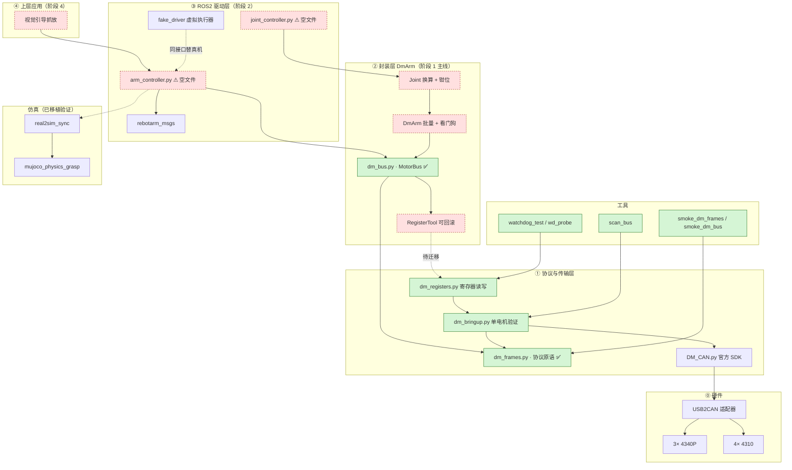
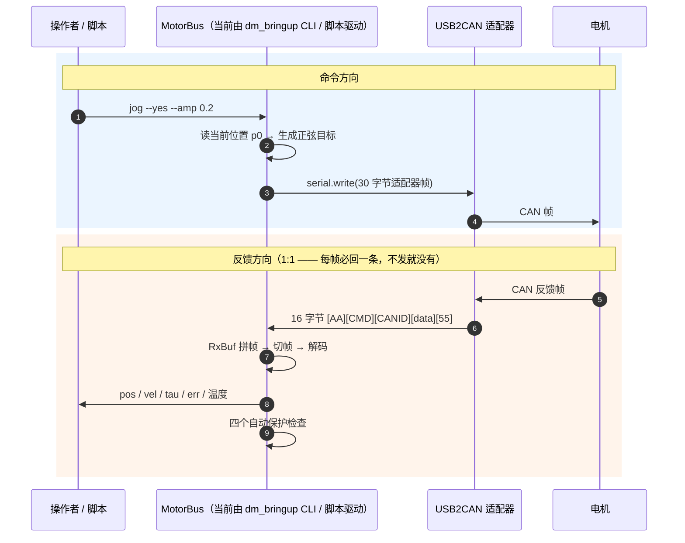

# DM_Armx 架构文档

> 桌面级 6 轴 + 夹爪机械臂，从零自搭 reBot 的最小 ROS2 版。
>
> 相关文档：[`readme.md`](readme.md) 路线与命令 · [`design.md`](src/DMmotor_driver/design.md) 设计决策 · [`docs/reading_guide.md`](docs/reading_guide.md) 蓝本导读
>
> 最后更新：2026-09-20

---

## 一、项目定位与当前进度

| 项 | 值 |
|---|---|
| 硬件 | 矽递 reBot Arm B601-DM 同款 / 仿件 |
| 电机 | 7 个达妙电机：3× **4340P**（关节 1-3）+ 4× **4310**（关节 4-6 + 夹爪） |
| 通信 | USB-CAN 适配器 → `/dev/ttyACM0` @ 921600 8N1 |
| 环境 | pixi 隔离（ROS2 Jazzy, Python 3.12），**一切命令走 `pixi run`** |
| 终点 | 真机视觉引导抓放 |

| 阶段 | 内容 | 状态 |
|---|---|---|
| 0 | 摸底与基线 | ✅ |
| 1 | **电机链路打通** | 🟡 **进行中** —— 单电机全通，整臂未做 |
| 2 | URDF + 运动学 + 最小 ROS2 控制器 | 🟡 仿真已通，真机驱动层未写 |
| 3 | 控制闭环 + MuJoCo 物理抓取 | ⬜ |
| 4 | Capstone：视觉引导抓放 | ⬜ |

**已验证**：仿真链路（colcon build / 模型加载 / 滑块→模型走真 DDS）、协议帧自测全绿、
单电机 MIT 点动（4310 与 4340P 各一只）、**1:1 请求-响应**、静摩擦
（4310 ≈ 0.15 N·m / 4340P ≈ 0.62 N·m）、链路上限 ≈ **3255 控制帧/s**、
**看门狗 0x09 = 500ms 已写入 flash 且断电重启后仍生效**、
**`MotorBus` 非阻塞收发 + 时序单测全绿**（假串口，尚未上真机）。

**还没验证**（别当已知）：7 关节同时挂总线 · **`MotorBus` 未在真机多电机上跑过** ·
POS_VEL 模式 · `direction`/`offset` 标定 ·
除 `0x01` 外的电机 ID 分配（其余是照抄蓝本的计划值）。

---

## 二、架构图

**三层边界：** ① 只管字节↔帧↔状态量（最危险，**只允许有一份** —— 现在这个"一份"就是 `dm_frames.py`）；
② 只管关节语义 ↔ 寄存器，**不 import rclpy**，可脱离 ROS 测；
③ 只管 ROS 接口契约，换仿真/真机只换驱动。

> **v0.7 变更**：协议原语从 `dm_bringup.py` 下沉到 **`dm_frames.py`**，`MotorBus`（`dm_bus.py`）落地。
> `dm_bringup.py` 现在只是**再导出**这些名字以兼容旧调用方（`tools/` 一行未改）。
>
> **v0.8 变更**：`dm_frames.py` 与 `dm_bus.py` **不再依赖官方 SDK** —— 30 字节发送帧模板、
> `float_to_uint` / `float_to_uint8s` 全部自持，六个构造函数不再收 `DM_CAN` 参数，
> `MotorBus(port, ...)` 取代 `MotorBus(sdk, port, ...)`。**上面那条 `BRINGUP → SDK` 仍然成立**：
> `dm_bringup.py` / `watchdog_test.py` 的**寄存器读写**还得用 SDK 的 `read_motor_param`，
> `third_party/` 不能删 —— 去掉的是「**封装层依赖厂商工具包**」，不是「全项目去 SDK」。
> 证据：把 SDK 移出 `sys.path` 后 `dm_frames` / `dm_bus` 仍能构帧（`smoke_dm_frames` 仍拿
> SDK 做整帧对拍，那是**测试**用它当尺子，不是**产品代码**依赖它）。

---

## 三、文件清单

### 安全等级

| 标记 | 含义 |
|---|---|
| 🟢 **只读** | 不使能、不发控制帧、不写寄存器、电机不动，任何时刻可跑 |
| 🟡 **会动/可恢复** | 使能出力，或写 **RAM**（断电即恢复），需 `--yes` / `--commit` |
| 🔴 **持久/需人工干预** | 写 **flash**（断电不丢），或会**锁存**必须人工断电 |
| ⚪ **第三方** | vendored，不改 |

### 清单

| 文件 | 作用 | 安全等级 |
|---|---|---|
| `ARCHITECTURE.md` | 本文档 | 🟢 |
| `readme.md` / `design.md` / `docs/*` | 路线 / 设计决策 / 蓝本导读 | 🟢 |
| `pixi.toml` / `pixi.lock` | pixi 环境 | 🟢（**别擅自改 lock**） |
| `tools/check_env.sh` | 环境自检 | 🟢 |
| `tools/smoke_dm_frames.py` | CAN 帧构造/切帧/解码，与 SDK 对拍（**不需要硬件**） | 🟢 |
| `tools/smoke_sim.py` / `smoke_slider_link.py` | 仿真冒烟（后者走真 DDS 验 QoS） | 🟢 |
| `tools/scan_bus.py` | 扫总线：哪些 ID 在线 + 型号判定 | 🟢 |
| `tools/watchdog_test.py` | 看门狗 A/B 对照实测 | 🔴 |
| `tools/wd_probe.py` | 看门狗阈值实测 / 验上电默认值 | 🔴 |
| `tools/smoke_dm_bus.py` | MotorBus 时序单测（假串口，**不需要硬件**） | 🟢 |
| `tools/smoke_joint.py` | Joint 控制类单测（假串口，**不需要硬件**）+ **"不碰寄存器"的静态检查** | 🟢 |
| `tools/bus_probe.py` | **MotorBus 真机只读探针**：连通 / 路由 / `poll()` 非阻塞 / 1:1 记账（**不 import SDK**） | 🟢 |
| `dm_frames.py` | **协议原语**：帧构造/切帧/解码（纯函数，无 CLI，**不依赖 SDK / numpy**） | 🟢 只构造，**不发帧** |
| `dm_bus.py` | **MotorBus**：非阻塞收发 + 状态缓存（**不依赖 SDK**，`MotorBus(port, ...)`） | 🟢 只收发，**不写寄存器、不自动使能** |
| `joint.py` | **Joint**：单电机控制类（换算 / 钳位 / 出错保护）。**MIT 已可用**，POS_VEL 与力位混控是预留桩 | 🟡 只发帧，**不写寄存器、不切模式** |
| `dm_bringup.py` | 单电机上电验证（协议原语已下沉，此处**再导出**以兼容） | 🟢 read/monitor；🟡 jog --yes |
| `dm_registers.py` | 寄存器读写（dump/verify/set/restore） | 🟢 只读/dry-run；🟡 `--commit`；🔴 `--commit --save` |
| `arm_controller.py` / `joint_controller.py` | ROS2 驱动节点 | ⚠ **空文件（0 行）** |
| `config/rebotarm_b601_mixed.yaml` | ⚠ **名不副实**：扩展名 yaml，内容是 Python | 🟢 |
| `DM-J4310/4340P-*.md` | 官方手册（0x09 单位就出自这里） | 🟢 |
| `fake_driver.py` | 虚拟执行器，不接电机 | 🟢 |
| `rebotarm_msgs/` | 自定义 msg/srv/action | 🟢 |
| `mujoco_pkg/`（7 节点 + 8 launch） | 仿真：real2sim / 物理抓取 / 相机 / 检测 / 滑块 GUI | 🟢 |
| `third_party/.../DM_CAN.py` | 达妙官方 SDK | ⚪ **不改** |

---

## 四、主要文件说明

| 文件 | 边界 / 关键设计 |
|---|---|
| **`dm_frames.py`** | **协议原语唯一的一份**。纯函数：帧构造（`build_tx` / `mit_frame` / `pos_vel_frame` / `cmd_frame` / `refresh_frame`）、切帧（`extract_rx` / `RxBuf` / `read_frames`）、解码（`decode_feedback`）。**不 import 本包其它模块、不 import argparse、不打屏、不 sys.exit、不发任何帧、不判断安全**。位置参数 `limit=(PMAX,VMAX,TMAX)` 必须由调用方按电机型号给对 —— 用错档位**力矩差 4 倍且不报错**。**自持 30 字节发送帧模板与定点映射，不依赖 SDK、不用 numpy**（v0.8）。 |
| **`dm_bus.py`** | **MotorBus**：7 关节共用一条总线的非阻塞收发 + 状态缓存。`send_frame` 是**唯一出口**（发之前不读）；`poll()` 非阻塞抽干（`read_frames(want=0, timeout=0.0)`）、跨圈复用同一个 `RxBuf`、尾部残片绝不丢；`send_and_wait` 把 flush→send→wait 做成**原子**（否则必然读到上一帧）。**安全边界**：不写任何寄存器、不调 `set_zero_position`、不自动使能、不切控制模式 —— 何时使能由 `Joint`/`DmArm` 决定。`MotorState` 是**电机侧原始量，未经 dir/offset 换算**（那是 `JointState` 的事）。**不依赖官方 SDK**（v0.8 起帧全由 `dm_frames` 自构），也不 import `numpy`。 |
| **`dm_bringup.py`** | **永不调用** `set_zero_position`、**不写任何寄存器**、**不切控制模式**。四个自动保护（ERR / tau / 使能跳变 / 丢帧）任一触发立刻失能退出；点动都"从当前位置出发 → 回原位 → 失能"。**协议原语已下沉到 `dm_frames.py`**，本文件保留**同名再导出**，所以 `tools/` 4 个脚本和 `dm_registers.py` 一行未改。 |
| **`dm_registers.py`** | `REFUSE` 字典**硬性拒绝**写只读/危险 RID。编码表是手抄的，所以每次接硬件都跑 `check_encoding()` 跟 SDK 全量对拍，不一致立刻终止。`--commit` 会**先存一份基线快照再写** —— 因为 `--save` 是最难撤销的操作，"用 restore 回滚"只在存在改动前快照时才成立。 |
| **`watchdog_test.py`** | 必须有 `TIMEOUT=0` 对照组，否则排除不掉"MIT 模式下电机本来就会断流自停"。武装看门狗**必须是停发前最后一步**（写寄存器要 ~150ms）。 |
| **`wd_probe.py`** | `sweep` 递增扫描卡阈值（必须升序 + 第一个触发就停，因为每次触发都要人工断电）；`default` 模式**全程不写 0x09**，验"电机上电默认就带保护"这件事本身。 |
| **`scan_bus.py`** | 只发刷新帧和读寄存器帧。利用 1:1 规律 —— 不发就没反馈，"没反馈"是干净判据。 |
| **`smoke_dm_frames.py`** | 尽量拿厂商 SDK 做对照而非自己验自己：同一段字节流同时喂给我们的切帧函数和 SDK 的，结果必须逐字节一致。 |
| **`design.md`** | D1-D9 设计决策 + 修订史 + 实测基线。**改封装层前必读**。换算只有 `dir`/`offset`，**没有 gear_ratio**。 |
| **`arm_controller.py` / `joint_controller.py`** | **0 行占位**。目前**没有任何 ROS 节点能驱动电机**，能跑的真机链路只有脚本直接开串口。 |
| **`config/rebotarm_b601_mixed.yaml`** | 内容是 Python（4 个 dataclass + `ArmConfig.from_yaml`），真正的 YAML 数据文件还不存在。建议改名 `arm_config.py`。 |
| **`DM_CAN.py`** | 路径含中文与空格 → 全程 `pathlib`。SDK 会丢反馈帧温度 `D[6]`/`D[7]`，我们自己解析。SDK 的 `control_Pos_Vel` **不能用**（内含 sleep + 阻塞 recv）。 |

---

## 五、数据流

**帧格式**

| | 发送 30 字节 | 接收 16 字节 |
|---|---|---|
| 帧头 | `55 AA` + 长度 `0x1e` | `AA` + CMD |
| CAN ID | `[13:15]` 小端 | `[3:7]` 小端 |
| 数据 | `[21:29]` 8 字节 | `[7:15]` 8 字节 |
| 帧尾 | — | `55` |

**CAN ID 规则**：POS_VEL = `0x100 + SlaveID`（**不是 SlaveID 本身**）；MIT = **SlaveID 本身**。

**反馈数据字节**：`D[0]=ID|ERR<<4` · `D[1:3]=POS` · `D[3:5]=VEL` · `D[5:7]=T` ·
`D[6]=T_MOS(℃)` · `D[7]=T_Rotor(℃)`。ERR：0 失能 / 1 使能 / 8 超压 / 9 欠压 / A 过流 /
B MOS 过温 / C 线圈过温 / **D=13 通讯丢失** / E 过载。

---

## 六、安全边界总览

| 等级 | 操作 |
|---|---|
| 🟢 **只读** | `check_env.sh` · `smoke_dm_frames.py` · `smoke_sim.py` · `scan_bus.py` · `dm_bringup read/monitor` · `dm_registers list/dump/verify` · **无 `--commit` 的 `set`** · `wd_probe --mode status` |
| 🟡 **会动/可恢复** | `dm_bringup jog --yes` · `bandwidth --enable --yes` · **`dm_registers set --commit`（写 RAM，断电即恢复）** · `restore --commit` |
| 🔴 **持久/需人工断电** | **`dm_registers set --commit --save`（写 flash）** · `watchdog_test --yes` · `wd_probe --mode sweep\|default --yes` |

**三条硬性事实**

1. **全仓库只有一处会写 flash**：`dm_registers.py:506` 的 `save_motor_param`，在 `cmd_set` 里且只有 `--save` 才走到。`set_zero_position`(0xFE) **从未被调用**。
2. **ERR=13 是锁存的**：`enable(0xFC)`、连发 MIT 帧、写回 `0x09=0` **都清不掉**，唯一办法是**给电机断电再上电**。所以看门狗实验每触发一次就要断一次电。
3. **写一次寄存器要 ~150ms，期间发不出帧**：运行期绝不能做寄存器 I/O —— 正确做法是上电时 `--save` 写进 flash，运行期不再碰。

**当前持久配置（2026-09-23 18:4x 实测）**：只有 **`0x01`（4340P）**配了看门狗，
且**值是 750ms**（不是 500ms）—— 详见下面的「⚠️ 0x01 的看门狗被人悄悄改掉过」。
其余 6 台上线时逐台 `scan_bus.py` 认清 → `set --rid 0x09 --value 500 --commit --save`。

> ⚠️ **0x01 的看门狗被人悄悄改掉过 —— 这是一条教训，不是一个勘误。**
>
> 时间线：09-20 给 0x01 写了 500ms 进 flash，**并跨断电验证通过**（`design.md:633-638`，记录正确）。
> 之后调试 ERR=13 时写了 `0x09 = 0` 试图解锁 —— **那次写带 `--save`**。
> 于是 flash 里变成 0，**0x01 有很长一段时间是没有任何保护的，而所有文档都还说它有。**
>
> **为什么没人发现**：那次 `--save` 没留下任何记录（当时 `--commit` 的"写前基线快照"
> 还没实现，见 `md:100` 条目 29），而"写回 0 没能解锁 ERR=13"被记成了**一次失败的实验** ——
> 没人注意到它**成功了地改掉了持久状态**。
>
> **怎么防**：① `--save` 之后**必须跨一次断电回读**才算验证（同批写入会互相掩盖）；
> ② 任何写了 flash 的操作，**哪怕实验失败**，也要记一笔。

---

## 七、关键教训

| # | 教训 |
|---|---|
| 1 ★ | **`0x09` 的单位是 50µs 计数，不是毫秒**（手册：一个计数周期 50µs）。**1ms = 20 计数**。写 `200` 得到的是 **10ms** 看门狗，比写一次寄存器本身（~150ms）还短 → 武装完就已经触发。**换算只在 `Reg.per_unit` 定义一处**，CLI 说毫秒并同时打印原始计数。 |
| 2 ★ | **pyserial 的 `read_all()` 是非阻塞的**：`write(); read_all()` 必然读到上一帧或空。修复要三件事一起：`RxBuf` 带残留缓冲（尾部不足 16 字节的残片**留到下次，绝不丢**，丢了后面全部错位）· 自己轮询 `in_waiting` 等到 deadline · 发命令前 `flush_rx`。 |
| 3 ★ | **SDK 的 `change_motor_param` 有缓存陷阱**：它拿**缓存**里的旧值跟新值比来判断成败 → 返回 `False`，**但帧已经发出去了，其实写成功了**。顺序必须是「读基线 → **再 `pop` 一次缓存** → 写」，且**以回读判成败，不信返回值**。 |
| 4 ★ | **标称波特率是摆设，但帧率是真天花板**：压到 167% 标称容量仍跑通，那套"按 921600 算超载"的算法作废；换来更硬的天花板 **≈3255 控制帧/s**，7×500Hz=3500 **刚好够不着** → **默认按 200~300 Hz/关节设计**。 |
| 5 ★ | **ERR=13 是锁存的**（同 §六 事实 2）。直接决定方法论：看门狗扫描必须**升序、第一个触发就停**。 |
| 6 | **时序 bug 只能用时序来测**：第一版 `smoke_dm_bus` 的假串口**在发帧之前就把回帧塞进了缓冲** —— 物理上不可能，于是 `flush_rx` 把回帧和残帧一起清掉，测试报 `None`。假串口必须**在 `write()` 里才追加回帧**，才复现得出"不 flush 就拿到上一帧的 stale 值"这一面。这类错误**代码看着完全正确**，只有真实到达顺序能暴露。 |
| 7 | **广播帧会把 1:1 计数算假**：刷新帧（`0x7FF`）是广播，一发 N 台回。混进 `sent` 计数会让"发出/收到"比例虚高。`send_refresh` 单独计 `n_sent_broadcast`，`n_sent` 反而减一。 |

> **教训的教训**：当"阈值 1000 却在 150ms 静默下触发"这种**算术矛盾**出现时，第一反应该是**去查单位**，而不是编一个能自圆其说的机制。

---

## 八、阅读顺序

**想搞懂项目**：§一 + §六 → [`readme.md`](readme.md) 当前可跑的命令 → §二 架构图 + §五 数据流
→ [`design.md`](src/DMmotor_driver/design.md) 定位与边界 + 关键决策 → **§七 教训**（最有价值）→ §九 待做

**想读代码**（从安全到危险）：
`smoke_dm_frames.py`（不需硬件，先看懂帧长什么样）→ **`dm_frames.py`**（协议原语，全项目地基：
`build_tx`/`mit_frame`/`pos_vel_frame`/`RxBuf`/`extract_rx`/`decode_feedback`）→
**`dm_bus.py`**（MotorBus，非阻塞收发 + 时序）→ `smoke_dm_bus.py` →
`dm_bringup.py` 的 `cmd_read`/`cmd_monitor`（只读路径）→ `scan_bus.py`（最短的完整工具）
→ `dm_registers.py`（第一次出现"写"）→ `cmd_jog_mit`（控制循环 + 四个保护）
→ `watchdog_test.py`/`wd_probe.py`（危险操作）

**想搞懂蓝本**：走 [`docs/reading_guide.md`](docs/reading_guide.md)。

---

## 九、待做清单

**P0**
- ~~`MotorBus` 非阻塞收发（design.md D2）~~ ✅ **已完成** —— `dm_frames.py` + `dm_bus.py` + `tools/smoke_dm_bus.py`。
  协议原语已从 `dm_bringup.py` 下沉到 `dm_frames.py`（`dm_bringup` 只再导出，`tools/` 一行未改）。
  ⚠️ `dm_bringup.py` / `dm_registers.py` **尚未迁到 MotorBus 上** —— 它们仍走自己的"发一帧等一帧"路径，
  迁移是下一步（`dm_registers.py:64-65` 已写下这个承诺）
- `JointConfig` / `ArmConfig`（含 PID 字段与型号校验）—— 需要 `pixi add pyyaml`
- ~~`Joint` 换算 + 钳位~~ ✅ **已完成**（`joint.py` + `tools/smoke_joint.py`）——**MIT 可用**；
  `set_pos_vel` / `set_force_pos` / `switch_mode` 是**预留桩**（都要先写 `0x0A`，需单独批准）
- `RegisterTool.dump_pid` / `verify_mapping`（"先读"，无风险）

**P1**
- **`arm_controller.py` / `joint_controller.py`（当前 0 行）** —— ROS2 驱动层完全没写
- `apply_pid` / `restore_pid`（带 dry-run）
- **标定脚本**：`direction` / `offset` 一个都还没标
- 错误码解码表 · `JointState` 全字段（含温度）
- **POS_VEL 路径**：切 `CTRL_MODE=2` 跑 `jog --yes`，实测 1:1 是否仍成立、`vlim` 实际效果

**需硬件**
- 7 关节满载下的 1:1 应答（3255 帧/s 是单电机的账，7 关节只会更低）
- 逐关节 `direction`/`offset` 标定 · 位置是否会绕圈
- 4340P 关节的重力补偿 kp（**逐关节实测**，不能照抄 reBot 的 `7.0`）
- 其余 6 台电机配看门狗

**文档已知不准确**（改起来很快）
- `readme.md` 的待办把看门狗列为"未做"——**这条现在是对的**（2026-09-23 实测：只有 `0x01` 有，
  其余 4 台接上的全是 0），示例还写 `0x09 = 200ms`（正确写法见
  `Reg.per_unit`，**1ms = 20 计数**）；另外 `readme.md` 里 10 处 `dm_bringup.py` 的裸脚本调用方式**必须保持可用**
- `config/rebotarm_b601_mixed.yaml` 改名 `arm_config.py` + 另建真正的 YAML 数据文件
- `package.xml` / `setup.py` 的 `description` 还是 `TODO`

**后续阶段**：2 URDF + 自写 FK/IK（用 reBot SDK / MuJoCo 交叉验证）· 3 控制闭环 + 重力补偿
· 4 Capstone（手眼标定 → 视觉检测 → IK → 轨迹 → 夹爪，先 sim 后真机）

---

## 附录：真机安全守则

1. 每次上电先看 `arm_status`/错误码；确认只有一个控制器占用总线
2. 全程低速、带限位测试；物理空间与人员隔离；保留急停
3. 机械限位/方向不对时**先失能再排查**，别硬顶
4. 调 PID/寄存器前备份当前配置；改一次重启验证一次
5. 断电顺序：先失能/回零，再关电源
