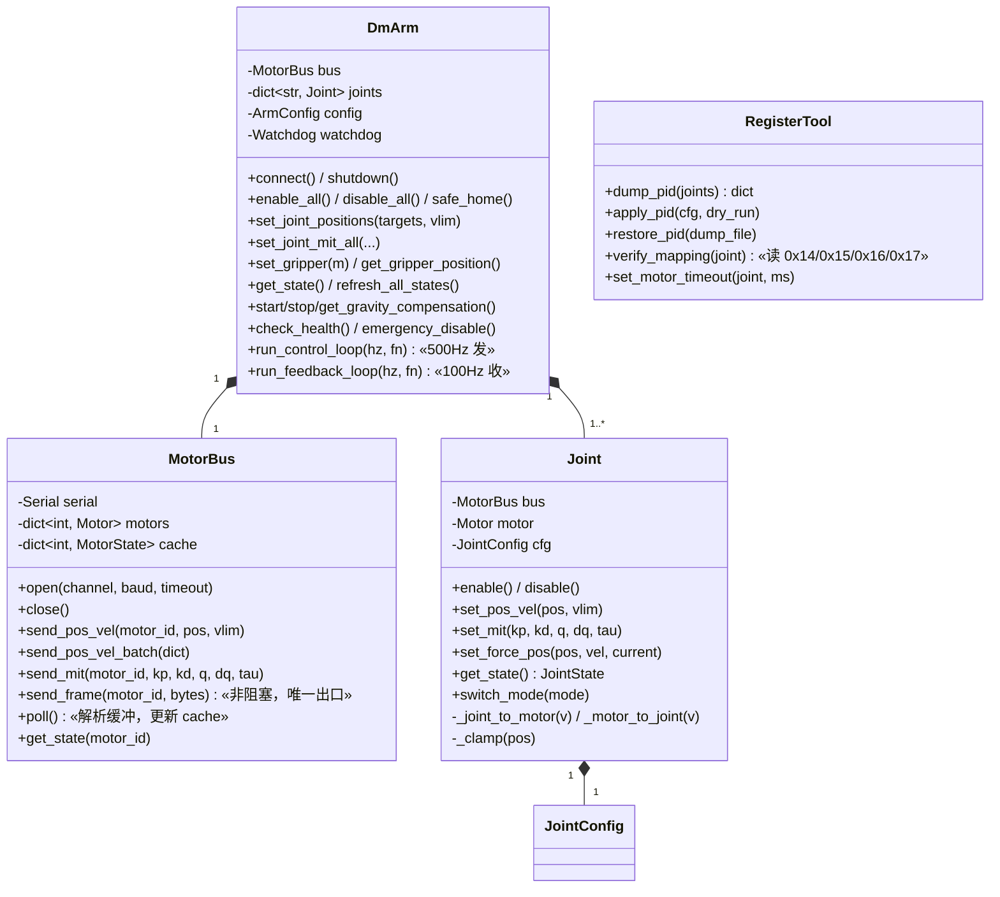
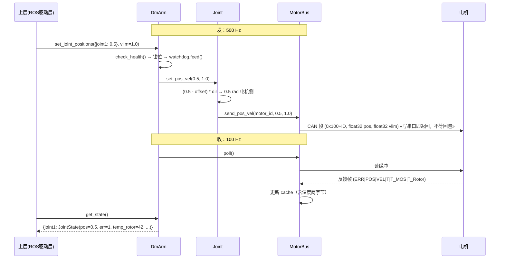

# DmArm 封装层设计文档（v0.7 —— MotorBus 落地 + 协议原语下沉）

> v0.1 → v0.2 修订依据：达妙官方手册（`DM-J4310-2EC.md` / `DM-J4340P-2EC V1.1 .md`）、
> reBot 真机层实测（`~/reBot_Arm_Mujoco-DM/reBotArm_ros2_DM/src/rebotarmcontroller/`）、
> reBotArm SDK 配置（`~/reBotArm_control_py/config/rebotarm_dm.yaml`）、
> 官方 SDK 源码（`src/third_party/Python例程/u2can/DM_CAN.py`）+ 官方 `USAGE.md`。
> 全部结论可追溯到具体文件行号，见文中标注。

## 〇、本次修订说明

### v0.6 → v0.7（2026-09-20，MotorBus 落地 + 协议原语下沉到 `dm_frames.py`）

§九 P0 的第一项（`MotorBus`）已实现。**这一轮没有新的硬件实测** —— 它验的是软件时序，
用假串口覆盖，所以下面是"设计落地"而不是"事实更正"。

| # | 内容 | 依据 |
|---|---|---|
| 30 | **新增 `dm_frames.py`**：`build_tx` / `mit_frame` / `RxBuf` / `extract_rx` / `read_frames` / `flush_rx` / `decode_feedback` 从 `dm_bringup.py` **原样搬出**（逻辑一行没改）。理由：原先封装层要用这些原语就得 import 一个 CLI 脚本，依赖方向是倒的，也不符合 §1.2 声明的依赖面。**协议代码全项目只允许有一份** | §1.2；`dm_registers.py:64-65` 早就写了"等 MotorBus 落地后两者都应迁过去，这里不重复实现" |
| 31 | **`dm_bringup.py` 改为再导出**：逐个名字 `from ... import` 并带 `noqa: F401`，对外名字一个不变 → `tools/` 下 4 个脚本与 `dm_registers.py` **一行都不用改** | `pixi run python tools/smoke_dm_frames.py` 全绿即为证据 |
| 32 | **裸脚本导入的坑（本条最值得记）**：`dm_bringup.py` 是**以裸脚本方式跑**的（readme 里 10 处）。此时它是 `__main__` 不是包成员，**相对导入 `from .dm_frames import ...` 会直接失败**。必须绝对导入 + `sys.path.insert` 兜底（`dm_registers.py:78-81` 早就是这套写法）。→ 验证清单里因此多了一条"裸脚本仍然能跑" | `readme.md:139-156` |
| 33 | **新增 `dm_bus.py`**：`MotorBus` + `MotorState`。`send_frame` 是**唯一发送出口**（非阻塞）；`poll()` 非阻塞抽干（就是 `cmd_bandwidth:1113` 的 `read_frames(want=0, timeout=0.0)`）；`send_and_wait()` 是 D2 说的"发一帧等一帧"，且把 **flush → 发 → 等** 合成**原子**一步 | D2「本层取两者并存」 |
| 34 | **新增 `pos_vel_frame()`**：POS_VEL 帧此前**只存在于 SDK 的 `control_Pos_Vel` 里，而那条路径不可用**（`sleep(0.001)` + `read_all()`）。现在按 §2.6 坑 1 的位布局自构，CAN ID = `0x100+ID`、数据 = `float32(P)+float32(V)` 无缩放 | SDK `DM_CAN.py:166-185` |
| 35 | **映射范围改为按电机注册**：`MotorBus.add_motor(id, limit)` 是发送与解码的**前置条件**，未注册就报错。这不是形式主义 —— 4310 与 4340P 档位不同，**用错档位力矩差 4 倍**（实测：同一段字节 4310 档 → 0.3004 N·m，4340P 档 → 0.8410 N·m），已钉成回归测试 | D5；`tools/smoke_dm_bus.py` [7] |
| 36 | **未注册 ID 的反馈不解码**，只记进 `unknown_ids`。宁可少一条数据，也不用错的档位解出一个差 4 倍的力矩 | 同上 |
| 37 | **1:1 计数把广播帧分开数**：`send_refresh()` 计在 `sent_broadcast` 而不是 `sent`。一条 0x7FF 会让**多台**电机各回一条，混在一起会让比值假性 >100% —— 看着像 bug，其实是记账错了 | `cmd_bandwidth:1073-1077` 已踩过这个坑 |

> **本轮的教训（不是硬件的，是软件的）**：MotorBus 最容易错的不是"算错"，而是**时序** ——
> 什么时候读、读之前要不要清缓冲、帧被拆成两半怎么办。这些在真机上表现为"偶尔丢一条"
> "数据慢一拍"，**极难查**。所以 `tools/smoke_dm_bus.py` 用假串口把时序钉死，其中
> [10] 特意按**真实时序**（残留帧先到、应答要等 write 之后）复现了正反两面：
> 不 flush 会拿到慢一拍的旧值。**"发之前 flush"这条规则，只有做成一个原子方法才防得住误用。**

### v0.5 → v0.6（2026-09-20，寄存器工具落地 + 看门狗实测 + 一个单位纠错）

新增 `dm_registers.py`（dump/verify/set/restore/list，默认 dry-run、写前自动 dump 基线、
`--commit` 才真写）、`tools/watchdog_test.py`（A/B 对照）、`tools/wd_probe.py`（递增静默扫描）。
以下每条都是实测。

| # | v0.5 的写法 | v0.6 的改法 | 依据 |
|---|---|---|---|
| 25 | D4 例子里写 0x09 = 200ms | **★ 0x09 的单位是「计数周期」，一个周期 50µs，不是毫秒** → 1ms = **20 个计数**。「写 200」实际武装的是 **10ms** 的看门狗，比写一次寄存器本身（~150ms）还短，**会在正常控制循环里疯狂误触发**。换算现在只在 `dm_registers.Reg.per_unit` 定义一处，CLI 层统一说毫秒并同时打印原始计数 | 手册 `DM-J4310-2EC.md:698` / `DM-J4340P-2EC V1.1 .md:702` 原文；`wd_probe.py` 实测阈值 ∈ (400,800] ms 与请求 500ms 吻合 |
| 26 | §十 第 5 条「0x09 写入后拔线是否真退出使能」挂 **⬜ 未测** | ✅ **已测，正反两面都拿到**：`0x09=10000`（＝500ms）时静默 ≤400ms 存活、**800ms 触发 ERR=13**；对照组 `0x09=0` 静默 1.5s **仍使能**（危险坐实）。D4 定稿 | §2.9（新增）；`watchdog_test.py` / `wd_probe.py` 输出 |
| 27 | D4 只写「上电时写入 0x09 并回读」 | **补三条会改驱动设计的约束**：① 任何帧（含 0x7FF 刷新帧）都重置计时器 → 测试不能轮询、只能"静默→单点观测"；② 写寄存器要 ~150ms 且期间电机侧全静默 → **运行期绝不能做寄存器 I/O**，必须上电时 `--save` 写 flash；③ ERR=13 是**锁存**的，`enable`/连发帧/写回 0 都清不掉，**只能断电重启** | D4；同批实测 |
| 28 | 阈值建议 200ms | 改为 **500ms**：主机侧控制循环 200~300Hz（D2），500ms ≈ 100~150 个周期余量，容得下调度抖动又远短于"人跑过去拔电源"。**已 `--save` 写 flash 并断电重启验证持久生效** | D4 取值建议 + 上线形态验证 |
| 29 | `set` 号称"写前自动 dump 基线"，但实际没做 | **补上实现**：`cmd_set --commit` 现在真的先存一份快照（新 `_dump_before_write`）。原状是 docstring 承诺了、代码里没有 —— 而 `--save` 写 flash 是**最难撤销**的操作，"改坏了 restore 回滚"这条退路当时是空的 | 写 flash 后去找回滚快照时发现；`grep save_dump` 只有 `cmd_dump` 调用它 |

> 第 25 条是本轮最有价值的一条，也是我自己写错、又用数据推翻的第二次：v0.5 时我一度
> 归因「写寄存器那 152ms 静默触发了看门狗」——**但 151 < 1000 本来就说不通**。真正的根因
> 是单位。教训记在这里：**当"阈值 1000 却在 150ms 静默下触发"这种算术矛盾出现时，
> 第一反应应该是去查单位，而不是去编一个能自圆其说的机制。**

### v0.4 → v0.5（2026-09-19，实测 4340P + 带宽压到天花板）

换上 4340P（ID 也是 `0x01`，Gr=40）重跑 `read → monitor → jog --mit`，并把
`bandwidth` 一路压到 4000 Hz。以下每条都是实测。

| # | v0.4 的写法 | v0.5 的改法 | 依据 |
|---|---|---|---|
| 20 | §2.6 坑 2 说「SDK 表 `DM4340=[12.5,10,28]` 与手册 40 N·m/5.86 rad/s **不符**」 | **这不是矛盾，是我把两个量当成同一个了**。手册那组是**物理能力**（额定 12 / 峰值 40 N·m、空载 56 rpm = 5.86 rad/s），`0x15/0x16/0x17` 是**MIT 帧的线性映射范围**（手册对 `0x17` 的原文就是"扭矩映射范围 RW"）。实测回读 = 12.5/10/28。→ **发帧用回读值（否则力矩比例算错），算动力学/重力补偿可用手册值** | 手册第 122-131 行 + 543-567 行寄存器表；实测见 §2.8 |
| 21 | D2「⚠️ 带宽账：6 关节 500Hz 已 97.7%、合计 111% → **超载**」 | **标称波特率是摆设，那套算法作废**：实测压到 **167% 标称容量**（154 KB/s）仍然跑通、1:1 应答 100.0% 不破。CDC-ACM 名义 921600 与真实吞吐无关。**但帧率仍有天花板**，实测约 **3255 控制帧/s**（单适配器 + 这个 Python 循环），7 关节 × 500Hz = 3500 **刚好够不着** | §2.8 第 4 条 |
| 22 | 未量化 4340P 的静摩擦 | **≈ 0.53~0.72 N·m（均值 ~0.62）**，是 4310（0.15）的约 **4 倍** —— 与 40:1 vs 10:1 的减速比精确吻合。要跟得好需要 **kp ≈ 25~60**（4310 只需 10~25） | §2.8 第 2 条 |
| 23 | D4/§十第 3 条挂"4340P 的重力补偿 kp 够不够" | **reBot 硬编码的 `kp=7.0` 对 4340P 关节偏小**：裸电机空载时 kp=15 才 91%（kp=7 会明显更差）。重力前馈本身能承担主要力矩，所以不是致命问题，但**必须逐关节实测标定 kp，不能照抄 7.0** | §2.8 第 2 条；对 §2.7 第 3 条（残差 = 摩擦/kp） |
| 24 | §2.7 只覆盖 4310 | **1:1 规律在 4340P 上复现**（monitor 249/249、jog 零丢帧、bandwidth 167% 下 100.0%）→ 它不是我那只 4310 的个案，可作为 D2 的通用前提 | §2.8 第 1 条 |

### v0.3 → v0.4（2026-09-19，**真机实测**一个 4310 之后）

单电机（ID `0x01`，裸电机空载）已按 `dm_bringup.py read → monitor → jog --mit` 跑通，
以下每条都是实测出来的，不是推导。原始数据见 §2.7。

| # | v0.3 的写法 | v0.4 的改法 | 依据 |
|---|---|---|---|
| 14 | 收发要解耦：**发 500Hz / 收 100Hz**，另发 100Hz 刷新帧（D2） | **1:1 请求-响应**：任何帧送达电机必**恰好回一帧**，什么都不发则没有反馈。所以控制帧自己就带回反馈，**reBot 那条 100Hz 刷新帧可以整个去掉**，白拿 500Hz 反馈 | 实测 697 帧零丢帧；见 §2.7 第 1 条 |
| 15 | D2 只说"用 `in_waiting` 判断可读字节数" | **补上反面**：pyserial 的 `read_all()` **非阻塞**，`write(); read_all()` 必然读到上一帧或空 —— 首次真机点动就是这么在第 1.6s 误判"收不到反馈"停机的。同步收发必须自己阻塞等到 deadline；且**尾部残片不能丢**（丢了后续字节全错位） | `dm_bringup.py` 的 `RxBuf`/`read_frames`；`tools/smoke_dm_frames.py` 第 [5] 节已把它做成回归测试 |
| 16 | D8 只写"逐关节切 MIT + 重力前馈" | **补上 MIT 的固有代价**：上位机做 PD 时**稳态残差 = 静摩擦 / kp**（实测 4 档 kp 严格成反比）。所以 MIT 只适合"要前馈"的场合，常规运动必须走 POS_VEL 固件闭环 —— 实测数据正面支持 D3 的「全 POS_VEL」决策 | §2.7 第 3 条：残差 0.079/0.025/0.015/0.003 rad @ kp 1/5/10/25 |
| 17 | D5 说 4340P 的映射范围"以回读值为准"（未实测） | 4310 已回读：**PMAX/VMAX/TMAX = 12.5 / 30 / 10**，与 SDK `Limit_Param` 表完全一致；`Gr=10` 确认是 4310 | §2.7 第 2 条 |
| 18 | §十第 2 条挂着"裸 int RID 能不能读 0x3C/0x3D/0x3E 未知" | **能**。`read_motor_param(motor, 60/61/62)` 直接可用，不必手工构造读取帧 | §2.7 第 2 条 |
| 19 | §九/§十 的悬空项 | **静摩擦已量化**：裸 4310 输出轴 ≈ **0.145~0.159 N·m**（5 档 kp 下峰值力矩都是这个值 → 它不是"kp 出多大力"，而是"轴有多粘"） | §2.7 第 3 条 |

### v0.2 → v0.3（2026-09-19，写 bring-up 脚本时发现）

| # | v0.2 的写法 | v0.3 的改法 | 依据 |
|---|---|---|---|
| 11 | §2.6 坑 4：「`read_motor_param` 是 20 × sleep(0.05)，读一个寄存器最坏 ~1s」 | **更正**：`else: return None` 挂在**内层 if** 上，20 次循环是死代码，实际行为是「等 1 个 50ms 就放弃」；且命中缓存就返回旧值、调用方无从分辨 → 必须自己清缓存 + 重试 | `DM_CAN.py:523-541` 的缩进（详见 §2.6 坑 4） |
| 12 | §2.6 带宽账只列了"两种可能" | 补官方旁证：`USAGE.md:110` 自己建议**每帧间隔 1~2ms**（= 单电机 500~1000 Hz 上限），说明 6×500Hz 已贴官方推荐上限，不是空担心 | `third_party/Python例程/u2can/USAGE.md:110` |
| 13 | §11.2 只列了 bring-up 脚本的范围 | 脚本**已实现**并跑通 `--dry-run`；新增硬件无关的 `tools/smoke_dm_frames.py`，把帧构造/切帧/反馈解码与厂商 SDK **逐字节对拍** | `DMmotor_driver/dm_bringup.py`、`tools/smoke_dm_frames.py` |

### v0.1 → v0.2

| # | v0.1 的写法 | v0.2 的改法 | 依据 |
|---|---|---|---|
| 1 | 每关节 `gear_ratio: 10.0`，`_joint_to_motor = (v-offset)*dir*gear` | **删除 gear_ratio 字段**，换算只剩 `dir`/`offset` | 手册 0x51 `xout` 已是"转子折算到输出轴"的 rad（4310 手册:595-596）；DM_CAN.py 与 reBot 全链路 0 处乘减速比；且 4340P 是 **1:40** 不是 10:1（4340P 手册:1083） |
| 2 | `set_joint_position` 直接调 `control_Pos_Vel` | **自构帧非阻塞发送**，收发解耦 | `control_Pos_Vel` 内含 `sleep(0.001)` + `recv()`（DM_CAN.py:184-185）；示例串口 `timeout=0.5`（DM_Test.py:9），空缓冲时 `recv()` 最坏阻塞 0.5s。7 电机 ×500Hz 不可行 |
| 3 | 无 POS_VEL PID 配置 | **JointConfig 增加 pos_kp/pos_ki/vel_kp/vel_ki/vlim**，并增加"先读后写"寄存器工具 | 本机硬件是全 POS_VEL 固件闭环，**PID 就是控制律**；reBot 逐关节写入 KP_ASR/KI_ASR/KP_APR/KI_APR（SDK `actuator/rebotarm.py:319-322`） |
| 4 | 示例 MIT 增益一律 `kp=20/kd=1` | 按型号分档：4340P `120/8`、4310 `18/2`、夹爪 `8/1` | `~/reBotArm_control_py/config/rebotarm_dm.yaml:30-135` |
| 5 | `JointState` 无温度/电压/使能位 | 增加 `temp_mos`、`temp_rotor`、`vbus`、`enabled`、`err` | 反馈帧 D[6]/D[7] 就是 T_MOS/T_Rotor（手册:336）；`check_health()` 要查温度电压却无处取 |
| 6 | 只有主机侧 `Watchdog` | **增加电机侧看门狗寄存器 0x09** | 手册特征参数表："通讯丢失防护：设定周期内没有收到 CAN 指令将自动退出使能模式"。主机进程被 kill 时主机侧看门狗无效 |
| 7 | 重力补偿"切 MIT 模式" | MIT + **逐关节切换** + 重力前馈；**不做渐变** | 真机路径逐关节 `ensure_mode(MIT)` 后立刻 `send_mit` 保持位置（`hardware_manager.py:436-465`），避免整组切换的无命令窗口。YAML 里那个 `transition_duration: 0.5` **ROS 驱动并不读取**，别照抄 |
| 8 | 无标定流程 | 新增第七节标定工作流 | 你的硬件是仿件，零位/方向必须实测 |
| 9 | 无 4340P 型号 | 自定义枚举值 + MIT 映射表按电机寄存器回读校准 | `DM_Motor_Type` 无 4340P（DM_CAN.py:643-658）；`Limit_Param` 里 DM4340=`[12.5,10,28]` ~~与 4340P 手册的 40 N·m / 5.86 rad/s 不符~~ ← **v0.5 第 20 条：这不是"不符"，是映射范围 vs 物理能力两个量** |
| 10 | `Control_Type` 切粘性模式 | **命令标志位驱动 + 显式切换**双轨 | ROS 侧 `JointMotorCmd` 带 `use_pos/use_vel/use_kp/use_kd/use_tau/use_vlim` 六个标志位 |

---

## 一、定位与边界

```
[ROS 2 驱动层]  ← 另开文档，本层不涉及（但要满足它的接口需求，见 1.3）
      ↓ 调用
[本封装层 DmArm / Joint]     ← 本文档的全部范围
      ↓ 调用
[DM_CAN.py 官方 SDK]  +  [自构帧的薄传输层]
      ↓
达妙 USB2CAN 适配器 (/dev/ttyACM0 @ 921600) → 电机
```

**替换对象**：本层替代 reBot 的 `reBotArm_control_py` actuator 层（`actuator/rebotarm.py`）+ `hardware_manager.py` 中的电机部分。
**可复用**：`reBotArm_control_py` 的 `kinematics/`、`dynamics/`、`trajectory/`（纯 numpy/pinocchio，与厂商无关），FK/IK/重力项可直接拿来交叉验证。

### 1.1 设计原则（v0.1 保留）

| 原则 | 说明 |
|---|---|
| 单位统一 | 关节 rad / rad·s⁻¹，夹爪 m（对外）；电机侧一律 rad，**无任何减速比折算** |
| 换算集中 | `direction`、`offset`、夹爪线性系数只在封装层做 |
| 安全内置 | 限位钳位、双层看门狗、可选的温度/电压检查、错误码解码 |
| 配置分离 | YAML + dataclass 校验 |
| 同步为主 | 默认同步阻塞，预留异步 |
| 可独立测试 | `import dm_arm` 即可用，不 import rclpy |
| **可回滚** | 写电机寄存器前必须先读并留存原值 |

### 1.2 依赖

| 依赖 | 来源 | 状态 |
|---|---|---|
| `pyserial` | pixi（`pixi.toml:16` `pyserial = ">=3.5,<4"`） | ✅ 已装（v0.7 更正：此前这里写"❌ 未装"是过期的） |
| `DM_CAN.py` | 已 vendored 在 `src/third_party/Python例程/u2can/DM_CAN.py` | ✅ |
| `numpy` | pixi（经 robostack 传递依赖；`dm_frames.tx_template` 与 SDK 都用到） | ✅ |
| `pyyaml` | pixi | ❌ 仍未加 —— 等 `ArmConfig.from_yaml` 那一轮（P0 第二项）再加 |
| **不使用 `motorbridge`** | —— | 它是 reBot 的依赖，你选了官方 SDK |

**本层自己的模块**（v0.7）：`dm_frames.py`（协议原语，纯函数）← `dm_bus.py`（MotorBus）。
两个都不 import `rclpy`，可脱离 ROS 独立测试（§1.1 原则）。

### 1.3 上层（ROS 驱动层）对本层的需求

ROS 侧要发的 `JointMotorCmd` 带六个 `use_*` 标志位，本层必须能表达三种组合：

| 标志位组合 | 本层方法 | 电机模式 |
|---|---|---|
| `use_pos` + `use_vlim` | `set_pos_vel(pos, vlim)` | POS_VEL（主用） |
| `use_pos/vel/kp/kd/tau` 全给 | `set_mit(kp, kd, q, dq, tau)` | MIT |
| `use_pos` + `use_vel` + `use_tau` | `set_force_pos(pos, vel, current)` | 力位混控 |

ROS 侧要发布的字段决定 `JointState` 必须携带：`position`、`velocity`、`torque`、`err`（→ `status_code`）、`temp_*`、`vbus`、`enabled`（→ `ArmStatus.enabled`）。

**名称对齐（需你确认）**：SDK 侧夹爪关节名是 `gripper`，ROS/MuJoCo 侧是 `finger_left`（MuJoCo `joint_map_kinematic.yaml` 再把 `finger_left` 映射到双指）。本层内部统一用 `gripper`，由 ROS 层做 `gripper ↔ finger_left` 的翻译。

---

## 二、事实基线

### 2.1 硬件分配（与你实机一致，来源 `~/reBotArm_control_py/config/rebotarm_dm.yaml`）

| 关节 | SlaveID | 反馈 ID | 型号 | 减速比 | MIT kp/kd | POS_VEL: vel_kp/vel_ki/pos_kp/pos_ki | vlim |
|---|---|---|---|---|---|---|---|
| joint1 | 0x01 | 0x11 | 4340P | 1:40 | 120.0 / 8.0 | 0.0125 / 0.004 / 150.0 / 0.5 | 5.0 |
| joint2 | 0x02 | 0x12 | 4340P | 1:40 | 120.0 / 8.0 | 0.0125 / 0.004 / 150.0 / 0.5 | 5.0 |
| joint3 | 0x03 | 0x13 | 4340P | 1:40 | 120.0 / 8.0 | 0.0125 / 0.004 / 150.0 / 0.5 | 5.0 |
| joint4 | 0x04 | 0x14 | 4310 | 10:1 | 18.0 / 2.0 | 0.0008 / 0.002 / 70.0 / 1.0 | 3.0 |
| joint5 | 0x05 | 0x15 | 4310 | 10:1 | 18.0 / 2.0 | 0.0008 / 0.002 / 60.0 / 1.0 | 3.0 |
| joint6 | 0x06 | 0x16 | 4310 | 10:1 | 18.0 / 2.0 | 0.0008 / 0.002 / 60.0 / 1.0 | 3.0 |
| gripper | 0x07 | 0x17 | 4310 | 10:1 | 8.0 / 1.0 | 0.0008 / 0.002 / 50.0 / 1.0 | 3.0 |

总线：`/dev/ttyACM0`，适配器串口 **921600**（注意：这是 UART 侧，**CAN 侧固定 1Mbps**，由寄存器 0x23 `can_br` 配）。控制循环 500Hz。设备权限 `sudo chmod 666 /dev/ttyACM*`。

> 注意 reBot 的配置里**完全没有** `direction` / `offset` / `gear_ratio` 字段（两个 repo 全量 grep 0 命中）。所以 v0.1 里那套换算是纸上推演的复杂度，本层保留 `direction`/`offset` 是为了标定仿件的装配误差，默认值必须让"不标定即等于 reBot 行为"（`dir=1, offset=0`）。

### 2.2 限位与力矩（来源 URDF，**不在电机配置里**）

| 关节 | 位置限位 (rad) | URDF effort (N·m) | MoveIt 速度限 (rad/s) |
|---|---|---|---|
| joint1 | [-2.8, 2.8] | 27 | 1.0 |
| joint2 | [-3.14, 0] | 27 | 1.0 |
| joint3 | [-3.14, 0] | 27 | 1.0 |
| joint4 | [-1.87, 1.57] | 7 | 1.0 |
| joint5 | [-1.57, 1.57] | 7 | 1.0 |
| joint6 | [-3.14, 3.14] | 7 | 1.0 |
| 手指 | finger_left 限位 0.0285（URDF） | 8 | 0.08 |

**限位以 URDF 为唯一真源**（`~/reBotArm_control_py/urdf/DM/urdf/ReBot_Arm_DM.urdf`），配置里改为引用而非硬编码。

> ⚠️ **POS_VEL 模式下上位机无法限力矩**。力矩只受电机侧 0x03 `OC_Value`（过流）与 0x17 `TMAX` 约束。所以 `JointConfig.torque_max` 应注明"仅 MIT/力位模式生效"。reBot 也没有软件力矩保护——这是你相对蓝本可以补上的一处。

### 2.3 夹爪换算（线性，来源 `hardware_manager.py:14-15, 552-560, 594-599`）

```
_G_MAX_DIST_M = 0.10     # 全开 0.10 m
_G_ANGLE_OPEN = -5.0     # 全开对应 -5.0 rad

m → rad:  angle = max((distance / 0.10) * -5.0, -5.0)   # 即 angle = -50.0 * distance_m
rad → m:  distance = (pos / -5.0) * 0.10                # 即 m = -0.02 * pos
rad/s → m/s: 系数 0.10 / -5.0 = -0.02
夹持力: _G_DEFAULT_FORCE = 0.30，钳位到 [0.05, 1.5]
到位容差: 0.12 rad
```

即 **0.10 m 全开 ↔ -5.0 rad**，线性、与开度无关。这两个常数写进 `GripperConfig`。

> ⚠️ reBot 发布 `/joint_states` 里的 `finger_left` 时乘了 `0.5`（`ros_publishers.py:77-78`），于是最大发到 0.05 m，而 URDF 限位是 0.0285——**这是 reBot 的一个疑似不一致**，本层不要照抄。以米为准，缩放留给可视化层。

### 2.4 用到的寄存器（来源手册"寄存器列表及范围"）

| RID | 名称 | 读写 | 用途 |
|---|---|---|---|
| 0x00 | UV_Value | RW | 欠压保护值 |
| 0x01 | KT_Value | RW | 扭矩系数（电流↔力矩换算） |
| 0x02 | OT_Value | RW | 过温保护值，范围 [80, 200) |
| 0x03 | OC_Value | RW | 过流保护值，范围 (0, 1.0) |
| 0x04 | ACC / 0x05 DEC | RW | 梯形加减速 |
| 0x06 | MAX_SPD | RW | 最大速度 |
| 0x07 | MST_ID | RW | 反馈 ID（= 0x11~0x17） |
| 0x08 | ESC_ID | RW | 接收 ID（= 0x01~0x07） |
| **0x09** | **TIMEOUT** | RW | **通讯丢失保护时间 → 电机侧看门狗**。⚠ **单位是 50µs 计数周期**（1ms=20 计数），不是毫秒 —— 见 D4 |
| 0x0A | CTRL_MODE | RW | 控制模式，[0,4] |
| 0x15/0x16/0x17 | PMAX/VMAX/TMAX | RW | MIT 映射范围（**可回读，用它校准而不是硬编码**） |
| 0x19~0x1C | KP_ASR/KI_ASR/KP_APR/KI_APR | RW | **POS_VEL 的 PID，控制律本体** |
| 0x23 | can_br | RW | CAN 波特率代码 [0,4] |
| 0x3B | Imax | RO | 驱动板最大电流 |
| 0x3C | VBus | RO | 电源电压 → 欠压检查 |
| 0x3D/0x3E | Tpcb / Tmt | RO | 驱动板温度 / 电机温度 |
| 0x14 | Gr | RO | 实际减速比（想验证型号就读它：应为 10 或 40） |
| 0x50/0x51 | p_m / xout | RO | 电机侧位置 / **输出轴位置（本层用的就是它）** |

### 2.5 错误码（反馈帧 D[0] 高 4 位，来源手册:341-355）

| ERR | 含义 | 应对 |
|---|---|---|
| 0 | 失能 | 正常（未使能时） |
| 1 | 使能 | 正常 |
| 8 | 超压 | 检查电源，24V 版建议 ≤32V |
| 9 | 欠压 | 检查电源，建议 ≥15V |
| A | 过电流 | 检查 0x03 OC_Value 与负载 |
| B | MOS 过温 | 降载/散热 |
| C | 线圈过温 | 降载/散热 |
| **D** | **通讯丢失** | 总线/适配器问题，配合 0x09 排查 |
| E | 过载 | 机械卡阻或增益过高 |

> reBot 全程只用 `status_code == 0` 判"正常"，**没有任何位定义表**，`ArmStatus.error_codes` 更是永远发空数组。本层把这张表做出来就是净增量。

### 2.6 SDK 的实际形状与三个坑（`DM_CAN.py`）

**可用的 API（与 v0.1 假设一致 ✓）**

```python
serial_device = serial.Serial('/dev/ttyACM0', 921600, timeout=0.5)   # 注意 timeout
ctrl = MotorControl(serial_device)                                    # 收串口对象，不是端口字符串
motor = Motor(DM_Motor_Type.DM4340, SlaveID=0x01, MasterID=0x11)
ctrl.enable(motor) / ctrl.disable(motor)
ctrl.controlMIT(motor, kp, kd, q, dq, tau)          # 注意是全小写 MIT，与 control_Pos_Vel 命名不一致
ctrl.control_Pos_Vel(motor, P_desired, V_desired)
ctrl.set_zero_position(motor)
ctrl.read_motor_param(motor, RID) / ctrl.change_motor_param(motor, RID, data) / ctrl.save_motor_param(motor)
ctrl.refresh_motor_status(motor)                     # 更新 motor.isEnable
motor.getPosition() / getVelocity() / getTorque() / getError()
motor.state_err                                      # = 反馈帧 ERR 半字节，可直接用 2.5 的表解码
```

**坑 1：`control_Pos_Vel` 不可用于控制循环**
`__send_data(motorid, data)` → `sleep(0.001)` → `recv()`（:183-185）。`recv()` 是 `serial_.read_all()`（:322），而示例串口 `timeout=0.5`。**7 电机 ×500Hz 直接出局。**
→ 设计决策 D2：自构帧（`float_to_uint8s(pos)` + `float_to_uint8s(vlim)` 拼 8 字节，CAN ID = `0x100 + SlaveID`，复用类内 `send_data_frame` 模板）直接 `serial.write()`，**无 sleep、无 recv**；收帧独立轮询。

**坑 2：`DM_Motor_Type` 没有 4340P**
枚举只有 `DM4310 / DM4310_48V / DM4340 / DM4340_48V / DM6006 / DM8006 / DM8009 / DM10010L / DM10010 / DMH3510 / DMH6215 / DMG6220 / DMJH11 / DM6248P / DM3507`（:643-658）。且 `Limit_Param` 表（:86-102）里 `DM4340 = [12.5, 10, 28]`。

> **⚠️ v0.5 更正**：v0.2 在这里写「`Limit_Param` 与 4340P 手册的 40 N·m / 5.86 rad/s **不符**」——
> 这**不是矛盾，是我把两个不同的量当成同一个了**：
>
> | | 手册值 | 是什么 | 用在哪 |
> |---|---|---|---|
> | 额定 12 / 峰值 40 N·m | ✅ 手册 126-128 行 | 电机**物理能力** | 选型、动力学模型、URDF 力矩上限 |
> | 空载 56 rpm = 5.86 rad/s | ✅ 手册 130 行 | 电机**物理最高转速** | 同上 |
> | `TMAX` = 28 / `VMAX` = 10 / `PMAX` = 12.5 | ✅ 实测回读 | **MIT 帧的线性映射范围**（手册对 `0x17` 原文：*"TMAX 扭矩映射范围 RW"*） | **编解码 CAN 帧**（比例算错 = 力矩全错） |
>
> 两套数**可以且本来就应该不同**：映射范围只要覆盖得住实际用量即可，不必等于物理极限。
> 所以 SDK 表恰好等于回读值不是巧合，而是达妙给 4340 系列的默认映射范围。
> **结论不变但理由要改**：编解码一律用**回读值**（实测 12.5/10/28，与 SDK 表一致，所以不覆盖也不会错，
> 但仍应回读 —— 万一某台被改过，覆盖是唯一能发现的办法）；而算重力补偿/动力学时用**手册值**。
→ 设计决策 D5（下节）。

**坑 3：反馈帧的温度被 SDK 丢掉了**
`__process_packet` 只取 ERR/q/dq/tau 调 `recv_data(q, dq, tau, err)`（:340-360），而帧里 D[6]=T_MOS、D[7]=T_Rotor（手册:336）**没被解析**。
→ 设计决策 D6：在收帧解析里把这两个字节也存下来，温度**零总线开销**白拿。

**坑 4：`read_motor_param` 其实不重试，而且会返回旧缓存（v0.2 里写错了，此处更正）**

v0.1/v0.2 我写的是「`max_retries=20 × sleep(0.05)`，读一个寄存器最坏 ~1s」——**这是错的**。看 :523-541 的实际缩进：

```python
for _ in range(max_retries):
    sleep(retry_interval)
    self.recv_set_param_data()
    if Motor.SlaveID in self.motors_map:
        if RID in self.motors_map[Motor.SlaveID].temp_param_dict:
            return self.motors_map[Motor.SlaveID].temp_param_dict[RID]
        else:
            return None          # ← 这个 else 挂在**内层 if** 上
```

`else: return None` 是内层 `if RID in ...` 的，不在 `for` 上。而 `Motor.SlaveID in self.motors_map` 对我们永远为真（已经 `addMotor` 过）。所以：

1. **实测行为是「等 1 个 50ms，没到就返回 None」**，那个 20 次循环是死代码 —— 这解释了为什么裸用它读寄存器会时不时读到 `None`；
2. 命中缓存就**立刻返回缓存值**，不判断新鲜度 —— 拿到的是上次的旧值，调用方**无从分辨**。

→ 所以任何调用点都必须自己包装：**每次尝试前 `motor.temp_param_dict.pop(RID, None)` 清缓存，失败就重试，并把重试次数如实报出来**（重试次数本身就是链路质量指标）。`dm_bringup.py read` 与将来的 `RegisterTool.dump_pid` 都是这么做的。
→ 另外「慢」这个结论仍然成立，只是原因不是 20 次循环：每次实际读写都要等 50ms，加上 `recv_set_param_data()` 的开销。所以寄存器操作依然只能在上电/标定阶段做，绝不进控制循环。

### 2.7 实机实测基线（2026-09-19，单只 4310，裸电机空载）

硬件：适配器 `2e88:4603 HDSC CDC Device`（= `/dev/ttyACM0`），24 V 供电，用户已在 `dialout` 组。

**① 1:1 请求-响应规律（本节最重要的一条）**

> **任何一帧送达电机，无论什么类型，都会恰好产生一个完整反馈帧；什么都不发，就一帧反馈都没有。**

验证方式：`jog --mit` 三个阶段共发 697 帧，收到 697 帧，**零丢帧**（每阶段实测都是 50.0 Hz）。
推论 → 改写 D2：

- 控制帧自己就带回反馈，**不需要 reBot 那条独立的 100Hz 刷新帧**；
- 于是"发 500Hz / 收 100Hz"这个解耦**没必要**，500Hz 发就是 500Hz 收，反馈率白涨 5 倍；
- 前提是**同步收发要写对**（见下面第 ④ 条），否则就会读到上一帧的旧值。

**② 寄存器回读（14 个，全部一次成功、重试 0 次）**

| 项 | 实测值 | 说明 |
|---|---|---|
| `Gr` (0x04) | **10** | 确认是 4310（4340P 应为 40） |
| `PMAX/VMAX/TMAX` (0x15/0x16/0x17) | **12.5 / 30 / 10** | 与 SDK `Limit_Param` 表的 DM4310 完全一致 → MIT 帧的映射范围就用这组 |
| `KP_APR` (0x1A) | **54** | 达妙出厂默认，**不是** reBot 的值 → 佐证 D7「PID 先读后写可回滚」是必要的 |
| `TIMEOUT` (0x09) | **0** | ⚠️ **看门狗是关的**（D4 要写的那个） |
| `MST_ID` (0x15?) | **0** | 反馈 CAN ID 实测就是 `0x000`，不是 `0x10+SlaveID` |
| `CTRL_MODE` (0x0A) | **1** | = MIT。所以本次点动**不需要写任何寄存器** |
| `VBus` / `Tpcb` / `Tmt` | 24.21 V / 29.66 ℃ / 27.48 ℃ | 温度反馈可读 |

- 电机 ID 实测是 **`0x01`**（不是脚本默认的 `0x04`）；扫描 ID 1–8 与 `0x0A`，**只有 `0x01` 有应答**。
- **§十第 2 条的悬空问题有答案了**：`0x3C/0x3D/0x3E` 可以用**裸 int RID** 直接读（`read_motor_param(motor, 60/61/62)`），不必手工构造读取帧。
- `monitor` 5 Hz 跑 10s，丢帧率 **0%**。

**③ MIT 闭环的真实行为：稳态残差 = 静摩擦 / kp**

裸电机给正弦指令（±0.2 rad @ 0.5 Hz，`kd=0.5`），扫 kp：

| kp | 实测幅值 / 指令 | 相位滞后 | 回 p0 残差 | 摩擦/kp 上界 | 峰值力矩 |
|---|---|---|---|---|---|
| 1.0 | 38% | 明显（>60°） | 0.0794 rad | 0.145 | ~0.144 |
| 5.0 | 85~87% | 18° | 0.0252 rad | 0.029 | 0.154 |
| 10 | 93% | 18° | 0.0145 rad | 0.0145 | 0.149 |
| 15 | 96% | 0° | 0.0046 rad | 0.0097 | 0.159 |
| 25 | 98% | 0° | 0.0034 rad | 0.0058 | 0.144 |

两条读出来的结论：

1. **残差 ≤ 摩擦 / kp** —— 不是"="，是**上界**。上位机做 PD 时，误差一路收小到 `kp·err` 顶不动静摩擦，轴就**停在那一瞬间**了，所以终值可以比边界更小（粘滑落点随机）。五档逐点核对全部满足：0.0794≤0.145、0.0252≤0.029、0.0145≤0.0145、0.0046≤0.0097、0.0034≤0.0058。
   推论：**MIT 下永远有静态误差，加大 kp 只能把上界压小、压不到 0**（要压到 0 得有积分项，而那是固件的事）→ 这就是常规运动不能用 MIT 的根本原因。
   （所以别拿 `kp × 残差` 当摩擦的估计：残差被粘滑落点随机化，那个乘积在 0.069~0.145 之间乱跳，不是常数。）
2. **峰值力矩在 5 档 kp 下都是 0.144~0.159 N·m，不随 kp 变** → 它不是"kp 出多大力"，而是"这根轴有多粘"。**裸 4310 输出轴静摩擦 ≈ 0.145~0.159 N·m**（约额定 3 N·m 的 5%，TMAX=10 的 1.5%）。这是后面重力补偿和整臂标定要用的真数，比查手册有用。
   - **别用「平均跟随误差 × kp」去反推摩擦**：那个量里混着动态滞后误差，会随 kp 变大而变大（实测 0.299 → 0.412），不是常数。我第一版就是这么写错的，已删。

→ 这两条**正面支持 D3 的「常规路径全走 POS_VEL 固件闭环」决策**：POS_VEL 是电机内部闭环（有积分），稳态误差能到 0，而且不需要上位机出那点力矩去顶摩擦（4310 是 0.15、**4340P 是 0.62 N·m**，见 §2.8）。MIT 只留给"需要重力前馈"的场合（D8）。

**④ 一个把我坑了 1.6 秒的坑：`read_all()` 是非阻塞的**

首版 `jog --mit` 的 `send()` 写成：

```python
ser.write(frame)
frames = [f for f in extract_rx(ser.read_all()) if f[1] == FEEDBACK_CMD]   # ← 错！
```

`read_all()` 立刻返回当前缓冲区内容、**不等**。写下去到反馈回来有 ~1ms，这一句必然读到**上一帧的反馈**或者空。表现：前 1.6 秒（~80 帧）一切正常，然后缓冲区凑巧被抽干的某一刻返回空 → 被判定成"收不到反馈，立即停止"并失能。**电机全程完全正常**（位置不漂、ERR=1、温度 28℃ 稳），是读法错了。

修法（`dm_bringup.py`）：

- `RxBuf`：带**残留**的接收缓冲。尾部不足 16 字节的残片**留到下次拼接**，绝不丢 —— 丢了会让后面**所有字节错位**（数据里凑巧凑成 `0xAA…0x55` 的 16 字节会被误认成帧）。
- `read_frames(ser, rx, want, timeout)`：轮询 `in_waiting` → 喂 `RxBuf` → 切帧 → 不够就等到 deadline。**不直接 `ser.read(n)`**，那会吃满串口自带的 50ms 超时，把高速循环拖垮。
- `flush_rx`：发命令**之前**丢弃残留，保证随后读到的是**本条命令的应答**，而不是上一条的（否则每次读到的位置/力矩都是 20ms 前的旧值，跳变/超力矩这类安全判断就建立在过期数据上了）。
- 偶发丢帧**先重发同一帧**（MIT 位置指令幂等），连续 `--miss-tol` 次才判链路断。

回归测试：`tools/smoke_dm_frames.py` 第 [5] 节用假串口按 1/5/9/16/17 字节分块喂 3 帧，必须一帧不少；同一节还留了个"反面教材"——逐块直接 `extract_rx` 在 5 字节/块下**一帧都切不出来**（0/3），把病因钉死。

### 2.8 实机实测基线（2026-09-19，换 4340P 之后）

把电机换成 **4340P**（也是 ID `0x01`，`Gr=40`）重跑同一套。工具新增 `tools/scan_bus.py`
（扫 ID + 认型号，只发查询帧），因为后面 7 个关节要陆续上线。

**① 只读转储（`read --id 0x01 --type DM4340`）**

| 寄存器 | 值 | 说明 |
|---|---|---|
| `Gr` (0x14) | **40** | 确认 4340 系列（1:40） |
| `PMAX/VMAX/TMAX` (0x15/16/17) | **12.5 / 10 / 28** | **MIT 映射范围**，与 SDK 表 `DM4340=[12.5,10,28]` 一致 |
| `KP_ASR/KI_ASR` (0x19/0x1A) | 0.00384 / 0.002 | 速度环 |
| `KP_APR/KI_APR` (0x1B/0x1C) | 54 / 0 | 位置环，与 4310 **相同**（达妙出厂默认，非 reBot 值） |
| `TIMEOUT` (0x09) | **0** | 看门狗仍**关着** |
| `MST_ID` (0x07) | 0 | 反馈 CAN ID 实测就是 `0x000`（不是 `0x10+ID`） |
| `CTRL_MODE` (0x0A) | 1 | MIT → `jog --mit` **零寄存器写入** |
| `VBus` (0x3C) | 24.27 V | 24V 供电正常 |
| `Tpcb` / `Tmt` (0x3D/0x3E) | 29.3 / 27.1 ℃ | 冷机 |

**② 静摩擦扫描（裸电机空载，amp 0.2 rad @ 0.3 Hz，钳位上限 5 N·m）**

| kp | 幅值 | 相位滞后 | 峰值力矩 |
|---|---|---|---|
| 2（amp 0.15） | **0%**（纹丝不动） | — | 0.321（**下界**：没动，说明摩擦 > 0.32） |
| 10（amp 0.15） | 80% | 11° | 0.663 |
| 15 | 91% | 22° | 0.527 |
| 25 | 94% | 11° | 0.581 |
| 60 | 97% | 11° | 0.718 |

- **裸 4340P 输出轴静摩擦 ≈ 0.53~0.72 N·m（均值 ~0.62）**，落在 0.15 × (40/10) = **0.60** 上 —— 4310→4340P 摩擦比与减速比 4 倍精确吻合。这条交叉验证让"峰值力矩 = 该轴静摩擦"这个判据更可信了。
- 但**离散度比 4310 大**（±16% vs ±5%）。原因大概是 TMAX 从 10 涨到 28 → 力矩 1 LSB 从 4.9 变 **13.7 mN·m**（量化更粗，只占 2%），且 40:1 的粘滑更明显。所以这个数应当读成"约 0.6 N·m 量级"，不要当 1% 精度的标定值。
- 全程峰值 ≤ 0.72 N·m = TMAX 的 **2.6%**、额定 12 N·m 的 **6%** → 裸电机测试是安全的（即便机身没夹紧也拧不动什么）。
- **工程结论：4340P 要跟得好需要 kp ≈ 25~60，4310 只需 10~25。** 直接后果见 v0.5 第 23 条（reBot 的 `kp=7.0` 不能照抄到 4340P 关节）。

**③ 1:1 规律复现（不是 4310 的个案）**

- `monitor --duration 5`：发 249 / 收 249，**0 丢帧**，实测 49.8 反馈/s（目标 50）
- `jog --mit` 每次：331~332 帧，零丢帧，实测 50 Hz
- `bandwidth --hz 4000`：167% 标称容量下 1:1 仍 **100.0%**（20126/20127）

→ D2 的 v0.4 更正（可以去掉独立刷新帧）**对两种型号都成立**。

**④ 带宽天花板（`bandwidth` 不加 `--enable`，纯发帧）**

| 目标 | 控制帧实测 | 占标称容量 | 1:1 |
|---|---|---|---|
| 500 Hz | 483 帧/s（97%） | 29% | 100.0% |
| 1000 Hz | 935（93%） | 51% | — |
| 2000 Hz | 1773（89%） | 93% | — |
| 4000 Hz | **3255（81%）** | **167%** | 100.0% |

- **「111% 超载」那套按帧长算的账作废**：标称 921600 对 CDC-ACM 是装饰性的，实测 154 KB/s 照跑。v0.2/0.3 里围绕"超载"的所有担心（含官方 `USAGE.md:110` 那条 1~2ms 间隔的旁证）都**不再构成风险**。
- **但帧率有天花板，而且是硬账**：冲 4000 Hz 只到 **3255 控制帧/s**（单适配器 + 这个 Python 循环）。**7 关节 × 500 Hz = 3500 → 刚好够不着**；反推每关节上限约 **465 Hz**，而这还是**纯发帧**的账，真机每轮要跑 7 个关节的控制律，实际更低。
  → **架构含义：单总线 7 关节按 500 Hz 设计是不安全的，应按 200~300 Hz/关节设计**（比例外推 7×300×46B ≈ 96.6 KB/s，不到实测天花板的 1/3），或者分两条总线/用 CAN-FD。这条要写进 D2。
- 写延迟（`ser.write` 阻塞时间）：均值 0.11~0.13 ms、p99 0.18~0.28 ms，但 **max 到过 5.4 ms** → 偶发的毫秒级抖动是真的，硬实时循环不能假设写是即时的。

---

## 三、关键设计决策

### D1 换算只有 `dir` 与 `offset`，没有 `gear`

```python
def _joint_to_motor(self, v):  return (v - self.cfg.offset) * self.cfg.direction
def _motor_to_joint(self, v):  return v * self.cfg.direction + self.cfg.offset
```
`direction ∈ {+1, -1}`，`offset ∈ [-π, π]`。**注意 `_motor_to_joint` 必须与 `_joint_to_motor` 严格互逆**，用属性测试（`hypothesis` 或手写随机对拍）锁住这一点。

### D2 非阻塞发送 + 收发解耦（本层最核心的改动）

```
发：500 Hz 定时循环 → bus.send_pos_vel_batch({motor: (pos, vlim)})   # 只写串口，不等回包
收：100 Hz 定时循环 → bus.poll() → 解析缓冲 → 更新各 Motor 状态缓存
```
对应 reBot 的真机行为：500Hz 循环**只发不读**，反馈刷新跟着 `/joint_states` 的 100Hz 走（`hardware_manager.py:704-730`、`ros_publishers.py:61`），夹爪另有 50Hz 线程。

**串口超时必须调小**（建议 1~5 ms）。这是 D2 能成立的前提：`timeout=0.5` 会让每次读阻塞 0.5s。收帧改用 `in_waiting` 判断可读字节数，凑够完整帧才解析（SDK 的 `__extract_packets` 可复用）。

#### ⚠️ v0.4 更正：1:1 应答让上面这套解耦**不再是必需的**

实测（§2.7 第 ① 条）：**发一帧就必回一帧，不发就没有**。于是在**同一个**控制循环里
`写一帧 → 阻塞等它自己那条反馈` 是可行的，而且：

- **不需要 reBot 那条独立的 100 Hz 刷新帧**（`0x7FF` 广播）—— 控制帧自己就把反馈捎回来了；
- 反馈率从 100 Hz 白涨到 500 Hz（对 `check_health()` 和力矩保护都是净收益）；
- 控制循环里读到的位置/力矩是**本帧的**，不是 20ms 前的，跳变/超力矩判断才立得住。

**但代价是把收发写对**，两个必须同时做到（§2.7 第 ④ 条）：

| 必须 | 不做的后果 |
|---|---|
| 发**之前** `flush` 掉残留帧 | 每次读到的是**上一帧**的反馈，位置/力矩恒定滞后一个周期 → 安全判断建立在过期数据上 |
| 读要**自己阻塞**到 deadline（轮询 `in_waiting`），不能用 `read_all()` | `read_all()` 非阻塞，写到读完之间反馈还没回来就返回空 → 误判"收不到反馈"。真机首测就是这么在第 1.6s 停机的 |
| 尾部**残片必须留**（`RxBuf`） | 残片一丢，后续字节全部错位，凑巧成 `0xAA…0x55` 的 16 字节会被误认成帧 |

**本层取两者并存**：

- **默认（7 关节满载）**：仍用"只发不读 + 100Hz 抽干"—— 因为 7 路的反馈不是每路都需要同样高的频率，而抽干是**非阻塞**的，不占循环时间。
  **v0.5 更正：速率从 500 Hz 下调到 200~300 Hz/关节**（依据 §2.8 ④：实测天花板 3255 控制帧/s，7×500 = 3500 够不着）。
- **单路调试 / 需要逐帧确认的场合**（`dm_bringup.py jog --mit`、将来的 `RegisterTool`）：用"发一帧等一帧"，因为此时**正确性 > 吞吐**，而且能把每条命令的应答单独归因。

#### ~~⚠️ 带宽账：按帧长算，这条链路是**超载**的~~ → **v0.5：已实测，作废**

> **结论先行（2026-09-19 实测，详见 §2.8 第 ④ 条）**：下面这套按"标称 921600 = 92,160 B/s"
> 算出来的账**是错的**。CDC-ACM 的标称波特率纯属装饰，实测压到 **167% 标称容量
> （154 KB/s）**仍然跑通、1:1 应答 100.0% 不破。**所以"超载"不成立。**
>
> **但换来了一个更硬的约束**：真正的天花板是**帧率**，实测约 **3255 控制帧/s**
> （单适配器 + 这个 Python 循环）→ **7 关节 × 500 Hz = 3500 帧/s 刚好够不着**，
> 每关节上限约 465 Hz，而这还是**纯发帧**的账。
> → **D2 的默认速率应从 500 Hz 下调到 200~300 Hz/关节**（7×300×46B ≈ 96.6 KB/s，
> 在实测天花板内有充足余量），或分总线。
>
> 下面保留原文，作为"纸面推导错在哪"的记录。

适配器协议有两套帧长，别搞混（`DM_CAN.py:83-85` 与 `:545-549`）：

| 方向 | 帧长 | 依据 |
|---|---|---|
| 发送（主机→适配器） | **30 字节** | `send_data_frame` 共 30 个元素，`[2]=0x1e=30` 即长度字段；`[13][14]`=CAN ID，`[21:29]`=8 字节数据 |
| 接收（适配器→主机） | **16 字节** | `__extract_packets` 的 `frame_length = 16`；`[3:7]`=CANID，`[7:15]`=数据，`[15]=0x55` 尾 |

921600 8N1 → 上限 **92,160 B/s**。按 reBot 的实际负载（6 关节 @500Hz 发 + 100Hz 收，夹爪独立 50Hz 线程）：

```
发送: 6 × 30 B × 500 Hz = 90,000 B/s        ← 已占 97.7%
接收: 6 × 16 B × 100 Hz =  9,600 B/s
夹爪: (30 + 16) B × 50 Hz = 2,300 B/s
合计 ≈ 101,900 B/s  ≈  链路容量的 111%      ← 超了
```

**两种可能**：(a) 达妙 USB2CAN 是 CDC-ACM 设备，固件并不真的把 921600 当速率上限（USB 全速 12Mbps 远高于此），标称值只是形式；(b) reBot 本来就贴着上限在丢帧。

**旁证（2026-09-19 补）**：达妙官方 `USAGE.md:110` 自己写着「推荐在每帧控制完后延迟 2ms 或者 1ms，usb 转 can 默认有缓冲器没有延迟也可使用，但是推荐加上延迟」——官方推荐的每帧间隔就是 1~2ms，换算单电机上限 **500~1000 Hz**。

> **v0.5 对这条例的再判读**：这条旁证当时被我用来"支持超载担心"，但实测表明它是**另一回事** ——
> 它讲的是**官方推荐值**（保守的用法建议），不是**物理上限**。实测 3255 帧/s 远超它推荐的
> 500~1000 Hz/单电机。所以它**不能再当作"6×500Hz 会超载"的依据**。
> 但它有个新用途：它和实测天花板（3255 帧/s）**数量级一致**，两者互相印证"这台适配器
> 确实在 3 kHz 量级到顶"，而不是无上限。

**实测已完成（v0.5）**：`dm_bringup.py bandwidth` 压到 4000 Hz，结论见 §2.8 第 ④ 条与上面那个框。
退路按代价递增：① 夹爪并入主循环但降到 100Hz；② 4310 组降到 250Hz；③ **整体降到 200~300Hz**（当前推荐）；④ 改 SocketCAN（`can0` @1Mbps）绕开串口瓶颈。

### D3 模式：命令驱动 + 显式切换双轨

- 常规路径：由 `JointMotorCmd` 的 `use_*` 标志位**每条命令决定**（见 1.3 表），无粘性状态 → 上层不会因为忘了切模式而发错帧。
- 专家路径：`switch_mode(joint, mode)` 显式切换，对应 `CTRL_MODE` 寄存器 0x0A。
- **切换必须逐关节做**，且切完立刻发一条保持当前位置的命令（reBot 的做法，`hardware_manager.py:436-465`），否则整组切换期间电机会处于无命令状态。

### D4 双层看门狗

| 层 | 实现 | 作用 |
|---|---|---|
| 主机侧 | `Watchdog`（软，100ms） | 检测上层控制循环卡死 |
| **电机侧** | **寄存器 0x09 `TIMEOUT`（如 500ms）** | **主机崩溃/断线时电机自己退出使能** ← v0.1 缺的就是这层 |

上电时写入 0x09，并**回读确认**。注意 0x09=0 表示关闭保护，务必非 0。

#### ★ 单位不是毫秒：一个计数周期 = 50µs（已实测）

手册（`DM-J4310-2EC.md:698`、`DM-J4340P-2EC V1.1 .md:702`）原文：

> 表示多少个计数周期后仍未检测到 CAN 命令，进行电机保护，**一个计数周期为 50us**，
> 只在电机使能时生效

即 **1ms = 20 个计数**。所以「写 200」得到的是 **10ms** 的看门狗，不是 200ms ——
这不是"没生效"，是生效了一个小 20 倍的阈值，会在正常控制循环里疯狂误触发。
**换算规则只在 `dm_registers.Reg.per_unit` 定义一处**，CLI 层统一说毫秒、
同时打印原始计数。这个坑是两轮测试测废后才定位的（见下）。

#### 实测记录（2026-09-20，裸 4310，`tools/watchdog_test.py` + `tools/wd_probe.py`）

**A/B/C 对照（`watchdog_test.py --yes`，3/3 符合预期）：**

| 组 | 请求阈值 | 写入的原始计数 | 静默时长 | 静默后 ERR | 判定 |
|---|---|---|---|---|---|
| A 对照 | 0（关闭） | 0 | 1.2 s | `1` **仍使能** | ← 危险坐实 |
| B 阈值下侧 | 500 ms | 10000 | 0.3 s | `1` 仍使能 | ✓ 未到点 |
| C 阈值上侧 | 500 ms | 10000 | 1.2 s | `13` **已失能** | ✓ 过点触发 |

**独立复验（`wd_probe.py` 递增静默扫描，写 10000）：** 静默 50 / 100 / 200 / 400 ms
全部存活、**800 ms 触发**。

→ 有效阈值 ∈ **(400, 800] ms**，与请求的 500ms 吻合，语义 = "距最后一条 CAN 帧超过
阈值就退出使能"。**正反两面都拿到了，D4 定稿。**

**上线形态验证（`--save` 写 flash 之后，`wd_probe.py --mode default`）：**

| 步骤 | 结果 |
|---|---|
| `set --rid 0x09 --value 500 --commit --save` | 回读 10000 计数 ✓ |
| **电机 24V 断电重启** | 再读 0x09 = **10000 计数（500 ms）** ✓ flash 持久化成立 |
| `--mode default`（**全程不写 0x09**）：使能 → 保持 119 帧 → 静默 1.2s | **ERR=13 已失能** ✓ |

最后一行才是驱动真正依赖的那条链路：驱动**不会**在运行期去写 0x09（D4 约束第 2 条
不允许），它指望的是"电机一上电就带着保护"。上面这行证明了那个指望成立。
`--mode default` 与 `--mode sweep` 的区别就在这：sweep 证的是"写入路径 + 看门狗"，
default 证的是"**没有任何人写它**时保护依然在"。

> **由此得到一条工具纪律**：任何清理/收尾代码**不能无条件写 `0x09 = 0`**。
> `wd_probe.py` 原来的 `finally` 就是这么写的（当成"还原成出厂默认"），
> 在 0x09 变成 flash 持久配置之后，这个动作会**把运行中的保护悄悄拆掉** ——
> 而 flash 里还是 500ms，于是表现为"配好了、但这次上电其实没保护"，
> 下次读寄存器还一切正常，极难发现。已改为"只在真改过它时还原成进来时的值"。

一个容易误读的细节：B/C 两组 `pos` 偏移都是 `+0.0000`。这**不是**"看门狗很温柔"，
而是因为被测的是一只裸电机、空载、且本来就静止（没有重力力矩要它扛）。
这里能确认的只有**失效方式是"松开"而不是"刹住"** —— 对真臂上的关节，
"松开"就意味着它在重力下直接掉下来。**这个危险在裸电机上演示不出来，别把
`+0.0000` 当成"所以没事"。** 要看到它，得等 7 关节满载（§十 第 8 条）。

#### 三条会影响驱动设计的实测约束

1. **任何发出去的帧都会重置计时器** —— 包括读状态用的 0x7FF 刷新帧。所以看门狗
   测试**不能轮询**（每次读 ERR 都清零计时器），只能"静默固定时长 → 单点观测"。
   反过来说，**正常控制循环只要按时发帧就永远不会触发**，这才是它安全的原因。
2. **写一次寄存器要 ~150ms，期间电机侧完全静默且无法压缩** → 阈值必须显著大于 150ms，
   且**运行期绝不能做寄存器 I/O**。正确做法：上电时 `set --save` 写进 flash，
   运行期不再碰。
3. **ERR=13 是锁存的** —— `enable(0xFC)`、连发 MIT 帧、写回 `0x09=0` 都清不掉，
   **只能电机断电重启**。所以看门狗实验每触发一次就要断一次电（USB-CAN 不用动）。

**取值建议**：主机侧控制循环 200~300Hz（D2），故 500ms ≈ 100~150 个控制周期的余量 ——
既容得下偶发的调度抖动，又远短于"人跑过去拔电源"的时间。**且必须 `--save` 写 flash**，
否则断电重启后看门狗又回到关闭状态，而人不会记得每次上电都去开它。

### D5 4340P 的型号与映射范围

1. 在 `DM_Motor_Type` 上加 `DM4340P = 15`，`Limit_Param` 追加一行。取值：`Q_MAX = 12.5`（同族），`DQ_MAX ≈ 6.0`（手册空载最大 56rpm = 5.86 rad/s），`TAU_MAX = 40`（手册峰值扭矩）。
2. **但不要信任这个硬编码值**：上电后读回电机自己的 0x15/0x16/0x17（PMAX/VMAX/TMAX），它们是 RW 且反映固件当前映射范围，**以回读值为准**，和配置不一致就报警。
3. 断言 0x14 `Gr` 应为 10（4310）或 40（4340P），用来兜底"型号填错"。

> 这三条合起来把 `DM_CAN.py` 硬编码表的隐患变成了自检项，是"吃透协议"的直接产出。

**v0.5 实测补充（重要 —— 别再把两套数混起来用）**

| 用途 | 用哪套数 | 4340P 的实际值 |
|---|---|---|
| **编解码 CAN 帧**（MIT 的 p/v/t 线性映射） | **`0x15/0x16/0x17` 回读值** | 12.5 / 10 / **28** |
| **动力学模型 / 重力补偿 / URDF 力矩上限 / 选型** | **手册物理值** | 额定 **12**、峰值 **40** N·m、空载 **5.86** rad/s |

两套数**本来就不同**（映射范围只需覆盖实际用量，不必等于物理极限）。v0.2 把二者当成
同一个量从而得出"SDK 表与手册矛盾"的结论，已在 v0.5 第 20 条更正。

另外，**回读到 28 并不意味着电机只能出 28 N·m**（物理峰值 40），但**MIT 帧能命令的上限就是 28** ——
要 28 以上的力矩只能走 POS_VEL（固件自己闭环，不受帧映射限制）。
实测中的实际用量只有 0.7 N·m（TMAX 的 2.6%），离这个上限很远。

### D5b 重力补偿（D8）的 kp 必须逐关节实测，不能照抄 reBot

reBot 真机重力补偿路径硬编码 **`kp=7.0` / `kd=0.8`**（见 D8）。实测：

- 裸 **4310** 空载：kp=10 → 93% 幅值；kp=7 大约够用
- 裸 **4340P** 空载：kp=15 → 仅 **91%**、kp=25 → 94%、kp=60 → 97%

而残余误差上界 = 静摩擦/kp（§2.7 第 3 条），4340P 的摩擦（~0.62）是 4310（0.15）的约 4 倍，
**同样 kp 下 4340P 的残差也大约是 4 倍**。所以：

- `kp=7.0` 用在 4310 关节上勉强合适，**用在 4340P 关节（1~3 轴）上偏小**；
- 但**不等于要盲目加大 kp** —— MIT 的 kp 越大，对反馈延迟/丢帧越敏感，越容易振。
  而且重力补偿本来就是"前馈承担主要力矩、kp 只修残差"，kp 需要的量取决于前馈准不准。
- **做法**：把 kp 放进 `JointConfig` 逐关节配置，装臂后**逐关节实测标定**；
  在臂上测时注意 4340P 的摩擦 0.62 N·m 意味着**前馈力矩低于此值时该关节根本不会动**，
  所以前馈必须包含摩擦项，否则会出现"指令发了、关节不动"的死区。

### D6 状态量来源

| 量 | 来源 | 频率 |
|---|---|---|
| position / velocity / torque | 反馈帧（16/12/12 位定点，SDK 已解码） | 100 Hz |
| err | 反馈帧 D[0] 高 4 位 | 100 Hz |
| **temp_mos / temp_rotor** | **反馈帧 D[6] / D[7]（需自己解析）** | 100 Hz |
| vbus | 寄存器 0x3C（RO），慢速读 | 1 Hz 或按需 |
| enabled | 寄存器 0x0A 控制模式 / 反馈状态 | 变化时 |

### D7 PID 先读后写、可回滚

`cmd` 或标定脚本里提供：
```
dump_pid()   → 逐关节读 0x19/0x1A/0x1B/0x1C，打印并落盘（含时间戳）
apply_pid(cfg) → 逐关节 change_motor_param 写入
restore_pid(dump) → 从落盘文件回写
save()       → save_motor_param 存 flash（**只在确认后才调，flash 有写寿命**）
```
**写 RAM 与存 flash 必须分成两个动作**，调参阶段只写 RAM，改一次重启验证一次（符合 readme 的真机守则）。

### D8 重力补偿

```
进入：逐关节 disable → ensure_mode(MIT) → 立刻 send_mit(当前 q, dq=0, kp_hold, kd_hold, tau_g)
运行：500 Hz，tau = tau_g(q) + 积分项；积分上限 ±0.5，运动时 ×0.9 衰减
      速度门限：线速度 0.04 m/s、角速度 0.08 rad/s（由 pinocchio EE 雅可比算）
增益：kp=7.0 / kd=0.8（reBot 真机实测值，`hardware_manager.py:24-25`）
退出：逐关节切回 POS_VEL，切完立刻发保持位置命令
```
**不做渐变**：v0.1/我最初引用的 `transition_duration: 0.5` 来自 YAML，而 ROS 真机路径**不读这个键**。真机的安全手段是逐关节切换，不是渐变。`tau_g` 用 `reBotArm_control_py.dynamics.compute_generalized_gravity`。

**v0.4 实测补充（§2.7 第 ③ 条）——MIT 到底该用在哪：**

MIT 是上位机自己做 PD，所以**稳态残差有上界 摩擦/kp，压不到 0**（实测 5 档 kp 全部符合）。这直接划出了适用边界：

| 场合 | 用哪个模式 | 为什么 |
|---|---|---|
| 常规运动（轨迹跟踪） | **POS_VEL 固件闭环** | 电机内部有积分，稳态误差能到 0；且**不需要上位机出那 0.15 N·m 去顶摩擦** |
| 重力补偿 / 需要力矩前馈 | MIT + `tau_g` | MIT 是唯一能直接给力矩的模式；此时 kp 只负责"托住"，重力由 `t_ff` 承担，k 残差问题不突出 |

两个具体影响：

1. ~~**`kp=7.0` 是够用的**~~ → **v0.5 更正：对 4310 关节够用，对 4340P 关节偏小**。按实测上界 `残差 ≤ 摩擦/kp`，4310 在 kp=7 时残差上界 ≈ 0.15/7 ≈ **21 mrad**；4340P 是 0.62/7 ≈ **89 mrad**，大 4 倍。实测裸机跟踪：4310 在 kp=10 已 93%，4340P 要 kp=25 才 94%。**所以 kp 必须逐关节配（见 D5b），不能整个臂用一个 7.0。**
2. **摩擦这个数要进标定表**（`config/rebotarm_b601_mixed.yaml`）：**已测两种型号** —— 裸 4310 ≈ 0.145~0.159 N·m，裸 **4340P ≈ 0.53~0.72 N·m（均值 ~0.62）**；其余 5 个电机待测。它是重力补偿积分项的初值和整臂力矩阈值（4.3）的依据 —— 而且**仿件的摩擦很可能比原厂大**，这正是要逐台实测的理由。
3. **4340P 的 0.62 N·m 带出一个新风险：前馈死区**。重力前馈 `tau_g` 若低于该关节的静摩擦，关节**根本不会动**（不是慢慢动）。所以 1~3 轴的 `tau_g` 必须包含摩擦补偿项，或者靠 kp·误差 把差额补上 —— 而后者又要求 kp 足够大。这是装臂后最该先验的一件事（§十 第 9 条的直接后果）。

### D9 限位钳位的位置

在 `Joint.set_pos_vel` 入口钳位（软限位），并**同时**保留一个更保守的 `safe_margin`（如 0.02 rad），避免贴限位撞机械挡块。位置源是 URDF（2.2），配置里只做覆盖。

---

## 四、类设计（修订后）

新增两个类：`MotorBus`（承担 D2 的非阻塞收发）与 `RegisterTool`（承担 D7）。

> **✅ v0.7 进展**：`MotorBus` 已实现（`src/DMmotor_driver/DMmotor_driver/dm_bus.py`）。
> 与下面这张类图有两处**有意的偏差**，都不是遗漏：
> 1. `send_frame(frame)` 只收已拼好的 30 字节帧，**不再单独传 motor_id** ——
>    CAN ID 已经在帧的 `[13:15]` 里了，传两个来源的 ID 就有不一致的机会。
> 2. 多了一组原类图里没列的方法：`send_enable` / `send_disable` / `send_refresh` /
>    `send_and_wait` / `flush` / `stats`。前三个是 `Joint`/`DmArm` 必然要调的下层动作
>    （类图上的 `Joint.enable()` 总得落到某条帧上）；`send_and_wait` 是 D2 明确要求的
>    "发一帧等一帧"那条路；`stats` 给 1:1 校验用。
>
> 另外 `cache` 的值类型定为 **`MotorState`（电机侧原始量）**，与 §4.1 的 `JointState`
> （关节侧、经 dir/offset 换算）**是两个类型，不要合并** —— 这一轮不实现 `JointState`。



### 4.1 JointState（修订）

```python
@dataclass
class JointState:
    name: str
    position: float        # rad（输出轴，无减速比折算）
    velocity: float        # rad/s
    torque: float          # N·m
    err: int               # 反馈帧 ERR 半字节，用 2.5 的表解码
    temp_mos: float        # ℃  反馈帧 D[6]
    temp_rotor: float      # ℃  反馈帧 D[7]
    vbus: float | None     # V   寄存器 0x3C，未读则为 None
    enabled: bool
    timestamp: float
```

### 4.2 JointConfig（修订）

```python
@dataclass
class JointConfig:
    name: str
    motor_type: str                    # "4340P" / "4310"，映射到 DM_Motor_Type
    slave_id: int
    master_id: int
    direction: int = 1                 # ±1，标定得出
    offset: float = 0.0                # rad，标定得出
    position_min: float | None = None  # None = 从 URDF 取
    position_max: float | None = None
    velocity_max: float = 1.0          # 来自 MoveIt 限速
    # --- POS_VEL（本机唯一实际生效的控制律）---
    pos_kp: float = 150.0
    pos_ki: float = 0.5
    vel_kp: float = 0.0125
    vel_ki: float = 0.004
    vlim: float = 5.0
    # --- MIT ---
    mit_kp: float = 120.0
    mit_kd: float = 8.0
    # --- 力矩（POS_VEL 下 torque_max 无效，靠 monitor 兜底）---
    torque_max: float = 12.0           # 仅 MIT/力位模式生效
    torque_monitor: bool = True        # POS_VEL 下额外监控（上位机唯一的力矩保护手段）
    torque_monitor_threshold: float = 15.0
    torque_monitor_count: int = 10     # 连续 N 次越限才急停，采样率 = feedback_hz
    # --- 安全 ---
    motor_timeout_ms: int = 200        # 寄存器 0x09
    def __post_init__(self): ...       # 校验 direction∈{±1}、min<max、timeout>0、按 motor_type 校验增益档位与力矩档位
```

> `__post_init__` 里建议加一条**型号-增益一致性检查**：`4340P` 的 pos_kp 应在 100~200，`4310` 应在 50~100；明显越界就报错。防止复制粘贴配置时串了档。

### 4.3 力矩阈值必须按型号分档

**不能全套关节用同一组数**——4310 的峰值只有 12.5 N·m，若阈值定 15 则永远不触发（等于没有保护）：

| 关节 | 型号 | 电机额定 | 电机峰值 | URDF effort | `torque_max`（MIT 用） | `monitor_threshold` |
|---|---|---|---|---|---|---|
| joint1-3 | 4340P | 12 | 40 | 27 | 12.0 | 15.0 |
| joint4-6 | 4310 | 3.5 | 12.5 | 7 | 3.5 | 5.0 |
| gripper | 4310 | 3.5 | 12.5 | 8 | 1.5 | 1.8 |

`__post_init__` 增加第二条一致性检查：`monitor_threshold` 必须 < 该型号峰值扭矩，否则报错（"这个阈值永远不会触发"）。

> **采样率绑定**：`torque_monitor_count` 按 `feedback_hz`（100 Hz）计数，10 次 = 100 ms 连续越限。**不要放在 500 Hz 发帧循环里数**，那样 10 次只有 20 ms，加速度峰值就会误触发。越限判定用反馈帧的 `torque` 字段（电机由电流估算，带噪声，所以需要 count 防抖）。

`GripperConfig` 在 v0.1 基础上增加 `m_per_rad = -0.02`（等价 `rad_per_m = -50.0`）、`arrive_tol_rad = 0.12`、`default_force = 0.30`、`force_range = (0.05, 1.5)`，并去掉 `open_position/close_position` 的裸值改为 `0.10 / 0.0` 配常数校验。

`SafetyConfig` 增加：`motor_timeout_ms`、`temp_warn/temp_fault`（建议 80/100，手册建议线圈不超 100℃）、`vbus_min/vbus_max`（24V 版建议 ≥15V、≤32V）、`feedback_hz`。

---

## 五、数据流（修订）



---

## 六、YAML 配置（修订示例，实际文件 `config/rebotarm_b601_mixed.yaml`）

```yaml
channel: /dev/ttyACM0
baudrate: 921600          # USB-CAN 适配器串口侧；CAN 侧固定 1Mbps
serial_timeout: 0.003     # 关键：必须远小于 1/500Hz
send_hz: 500
feedback_hz: 100
default_mode: POS_VEL
urdf_path: ../third_party/urdf/ReBot_Arm_DM.urdf   # 限位真源

joints:
  joint1:
    motor_type: "4340P"      # 非 DM4340！减速比 1:40
    slave_id: 0x01
    master_id: 0x11
    direction: 1             # 标定得出
    offset: 0.0              # 标定得出
    pos_kp: 150.0
    pos_ki: 0.5
    vel_kp: 0.0125
    vel_ki: 0.004
    vlim: 5.0
    mit_kp: 120.0
    mit_kd: 8.0
    torque_max: 12.0                 # 4340P 额定
    torque_monitor: true
    torque_monitor_threshold: 15.0
    torque_monitor_count: 10         # × feedback_hz(100) = 100ms 防抖
    motor_timeout_ms: 200
  # joint2/joint3 同上；joint4~joint6 为 4310 档
  #   pos_kp: 70/60/60, pos_ki: 1.0, vel_kp: 0.0008, vel_ki: 0.002, vlim: 3.0
  #   mit_kp: 18.0, mit_kd: 2.0
  #   torque_max: 3.5, torque_monitor_threshold: 5.0   ← 4310 峰值仅 12.5，别沿用 15

gripper:
  motor_type: "4310"
  slave_id: 0x07
  master_id: 0x17
  direction: 1
  offset: 0.0
  m_open: 0.10             # 全开 0.10 m
  rad_open: -5.0           # 对应 -5.0 rad
  default_force: 0.30
  force_min: 0.05
  force_max: 1.5
  arrive_tol_rad: 0.12
  torque_max: 1.5                  # 夹爪限力
  torque_monitor: true
  torque_monitor_threshold: 1.8    # 抓空/夹住时最先触发的保护

safety:
  watchdog_timeout: 0.1
  motor_timeout_ms: 200
  temp_warn: 80.0
  temp_fault: 100.0
  vbus_min: 15.0
  vbus_max: 32.0
```

---

## 七、标定工作流（新增）

你的硬件是**仿件**，装配零位/方向可能与 reBot 不同，这一步不能省。做成可重复执行的脚本，每一步都要求人工确认后才继续。

| 步 | 动作 | 安全措施 | 产出 |
|---|---|---|---|
| 0 | 只连一个电机（如 joint4/4310，力矩小） | 电机空载、固定好 | 总线通 |
| 1 | 读 0x14 `Gr`、0x15/0x16/0x17、0x19~0x1C 并落盘 | 只读，不动 | `dump_<date>.yaml` |
| 2 | `enable` → 低速点动 ±0.2 rad（`vlim=0.3`） | 全程手放在急停/电源上 | **direction** 判定 |
| 3 | 读回 0x51 `xout`，确认"指令 +0.2 rad → 反馈也 +0.2" | 若反向则 direction=-1 | direction 定值 |
| 4 | 手动把关节推到机械零位（或对准标记），记 `xout` | 先 `disable` | **offset = -xout·dir** |
| 5 | 写入 offset，重跑步 2-3 复核 | —— | offset 定值 |
| 6 | 逐关节重复 3-5 | 一次只动一个关节 | 全部 offset |
| 7 | 读 0x09，写入 500ms（=10000 计数，见 D4），**`--save` 写 flash**，回读确认 | 只写这一个 | 电机侧看门狗生效 |
| 8 | 7 关节低速联动到 URDF 零位，对比 `safe_home` | 速度 ≤0.5 rad/s | 整臂可用 |

**标定脚本必须支持 `--dry-run`**：打印将要写入的寄存器与值，不实际写。

---

## 八、上电 / 使能 / 失能 / 回零序列（含 reBot 实测延时）

```
connect:  开串口(timeout=3ms) → 建 Motor 对象 → 读 0x14/0x15/0x16/0x17 校验型号 → 断言 Gr∈{10,40}
enable:   逐关节 enable → sleep(0.05)/个
          → 逐关节 写 POS_VEL PID 寄存器(sleep 0.02) → ensure_mode(POS_VEL, timeout=1000) → sleep(0.05)/个
          → 组尾 sleep(0.2)
          → 写 0x09 = 500ms（=10000 计数，D4：单位是 50µs）→ 回读确认
          → 启动 500Hz 发帧循环 + 100Hz 收帧循环
recover:  若反馈出现 D(通讯丢失)/8/9/A/B/C/E → 按 2.5 表分类处理；8/9 检查电源，A/B/C/E 降载或急停
safe_home: 最小 jerk 轨迹 10s³-15s⁴+6s⁵，50Hz 流式下发
          max_vel=0.5, 到位阈值=0.01 rad, 超时 15s, 到位后再保持 3s
          已在 0.01 rad 内则直接返回；夹爪单独回零
set_zero: 仅用于恢复出厂零位 —— disable → sleep(0.3) → 逐关节轮询 status_code==0（200×0.05 上限）
          → set_zero_position → sleep(0.1)   ⚠️ 会改电机内部零位，标定前不要用
disable:  停循环 → 清零/保持 → 逐关节 disable → sleep(0.05)/个
shutdown: 停循环 → disable → sleep(0.5) → 逐关节 shutdown → sleep(0.1) → 关串口
```

---

## 九、实现优先级（修订）

| 优先级 | 模块 | 说明 |
|---|---|---|
| ~~**P0**~~ | ~~`MotorBus` 非阻塞收发~~ | ✅ **已完成（v0.7）**：`dm_bus.py` + `dm_frames.py`（协议原语下沉）+ `tools/smoke_dm_bus.py`。含串口 timeout=3ms、非阻塞 `poll()`、原子 `send_and_wait()`、按电机注册映射范围 |
| **P0** | `JointConfig` / `ArmConfig` | 含 v0.2 新增的 PID 字段与型号校验 |
| **P0** | `Joint` 换算 + 钳位 | D1/D9，含互逆性测试 |
| **P0** | `RegisterTool.dump_pid` / `verify_mapping` | D7 的"先读"，无风险 |
| **P1** | `RegisterTool.apply_pid` / `restore_pid` | D7 的"后写"，带 dry-run |
| **P1** | 电机侧看门狗（0x09） | D4。**#0x01 已完成**：500ms 写入 flash、断电重启仍生效（`wd_probe` 前的 `--save`）。**其余 6 台未做** —— 注意 `--save` 是不可逆的持久化改动，逐台需要单独确认；且触发过一次 ERR=13 后**必须断电**才能继续 |
| **P1** | 标定脚本（第七节） | 仿件必需 |
| **P1** | `JointState` 全字段（含温度解析） | D6 |
| **P1** | 错误码解码表 | 2.5 |
| **P2** | `check_health` / `emergency_disable` | 主机侧看门狗 + 分级检查 |
| **P2** | 重力补偿 | D8，依赖 pinocchio |
| **P2** | `set_force_pos` | 夹爪限力 |
| P3 | 异步接口、多总线 | 预留 |

---

## 十、上电必须验证的清单（纸面推导 vs 实测）

图例：✅ 已实测（结果见 §2.7 / §2.8）　🟡 部分验证　⬜ 仍待验证
**注意**：已测的都只是**单电机、裸电机空载**（4310 与 4340P 各一只）。整臂 7 关节同时跑、
POS_VEL 模式、带负载 —— 都还没测。

| # | 待验证 | 状态 / 结果 | 若不符的应对 |
|---|---|---|---|
| 1 | **串口带宽是否真的够**（按帧长算 111%，超载） | ✅ **"超载"证伪**：实测跑到标称容量 **167%**（154 KB/s）仍通、1:1 不破 → 标称波特率是摆设。**但帧率有硬天花板 ≈ 3255 控制帧/s**，7×500Hz=3500 够不着 → **默认速率下调到 200~300 Hz/关节** | 见 §2.8 ④；退路 ①→④ 逐级降频，或改 SocketCAN |
| 2 | 4 号坑：`read_motor_param` 传裸 int（如 0x3C=60）能否读到 VBus | ✅ **能**，`60/61/62` 直接可用，VBus=24.27V | 自己构读帧（`__read_RID_param` 的形状） |
| 3 | 4340P 的 0x15/0x16/0x17 回读值 | ✅ **已读 = 12.5 / 10 / 28**（4310 是 12.5/30/10）。**已确认这不是"与手册矛盾"** —— 它是 MIT 映射范围，与物理峰值 40 N·m 是两回事，见 D5 | 以回读值编解码；动力学用手册值 |
| 4 | 仿件的 `direction` / `offset` | ⬜ 需装机后做 | 第七节标定 |
| 5 | 电机侧 0x09 写入后，停发帧是否真的退出使能 | ✅ **已测**（2026-09-20，`watchdog_test.py` 3/3）：请求 500ms（写入 10000 计数）时**静默 0.3s 仍使能、1.2s 触发 ERR=13 失能**；对照组 `0x09=0` 静默 1.2s 仍使能。独立扫描复验阈值 ∈ (400,800] ms。**顺带纠正：0x09 的单位是 50µs 计数不是毫秒**，见 D4 | 这是安全底线 —— 正反两面都已拿到，D4 已定稿 |
| 6 | POS_VEL 下 `vlim` 的实际效果（梯形匀速度？） | ⬜ 需切 POS_VEL 后才能测 | 手册："速度给定是梯形加减速运行下最高速度，即匀速段速度值" |
| 7 | 位置是否会绕圈（单圈编码器 + 多圈累计） | ⬜ 单次点动范围太小（±0.2 rad），没跑到多圈 | 若会绕，需在收帧侧做 2π 解缠（reBot 只在重力补偿路径做了，见 `hardware_manager.py:406-410`） |

**v0.4 新暴露、必须补测的三件事**（都是这次真机跑出来的）：

| # | 待验证 | 状态 / 为什么重要 |
|---|---|---|
| 8 | **7 关节满载下的 1:1 应答是否仍成立** | ⬜ 单电机（两种型号）都成立；7 路同时发帧时反馈会不会互相挤掉仍未测。§2.8 ④的天花板（3255 帧/s）是**单电机纯发帧**的账，7 关节下的真实上限只会更低 |
| 9 | **4340P 的静摩擦** | ✅ **已测 ≈ 0.53~0.72 N·m（均值 ~0.62）**，是 4310 的约 4 倍（与 40:1/10:1 吻合）。→ 直接后果：**reBot 的 `kp=7.0` 不能照抄到 4340P 关节**，见 D5b |
| 10 | **使能 + POS_VEL 下的 1:1** | ⬜ §2.7/§2.8 的 1:1 都是 **MIT 模式、未使能**下测的。**注意**：`bandwidth` 已意外提供了半个证据 —— 电机在 MIT 模式 + **失能**状态下，收到 POS_VEL 帧照样每帧回一条（167% 那次 100.0%）。所以"不认这个帧也回"已经成立，剩下的是"使能 + POS_VEL 闭环中的回帧行为" |

**v0.5 新暴露的一项：**

| # | 待验证 | 为什么重要 |
|---|---|---|
| 11 | **`ser.write()` 的偶发 5 ms 抖动** | 实测写延迟均值 0.11~0.13 ms、p99 0.18~0.28 ms，但 **max 到过 5.4 ms**。硬实时控制循环不能假设写是即时的 → 控制周期要留余量，或用独立发送线程（D2 的收发解耦其实正好能吸收它） |

---

## 十一、已确定的决策（2026-09-19）

| 项 | 决定 |
|---|---|
| 夹爪关节名 | 本层内部用 **`gripper`**，`gripper ↔ finger_left` 的翻译放在 ROS 层 |
| 力矩保护 | **软限 + 监控双轨**：`torque_max`（仅 MIT/力位生效）+ `torque_monitor`/`_threshold`/`_count`（POS_VEL 下生效）。阈值**按型号分档**，见 4.3 |
| 标定脚本 | **并入本包**（entry_points，不单独成包） |
| bring-up 脚本 | **要**，且**刻意不依赖封装层**（直连 `DM_CAN.py`），先验证协议与硬件，其结论反过来校正封装层设计 |

### 11.1 entry_points（本包对外命令）

```python
entry_points={
    'console_scripts': [
        'dm-bringup = DMmotor_driver.dm_bringup:main',     # 单电机上电验证（先做）
        'dm-calibrate = DMmotor_driver.dm_calibrate:main', # 第七节标定流程
        'dm-dump-registers = DMmotor_driver.dm_registers:main',  # PID/映射范围读写（先读后写）
    ],
}
```

### 11.2 bring-up 脚本的范围（`dm_bringup.py`）——**已实现（2026-09-19）**

代码：`DMmotor_driver/dm_bringup.py`。刻意站在封装层**之外**，只依赖 `DM_CAN.py` + `pyserial`，用来把第十节里最关键的几条实测掉：

| 子命令 | 作用 | 风险 |
|---|---|---|
| `read`（默认） | 读 0x14 `Gr`（验型号）、0x15/0x16/0x17（定 MIT 映射表，**并用回读值覆盖 `Limit_Param`**）、0x19~0x1C（存 PID 现状）、0x09/0x07/0x0A、0x3C/0x3D/0x3E（**顺便测裸 int RID 能否读到**） | 只读 |
| `monitor` | 按 feedback_hz 刷新状态（含 D[6]/D[7] 温度，自己解帧），统计丢帧率 | 只读 |
| `jog` | 单电机低速点动正弦 ±0.2 rad，打印"命令 → 30 字节发送帧 → 16 字节反馈帧" | 需 `--yes` |
| `bandwidth` | 按 `--hz` 硬发 N 秒，量实际速率/字节数/**单帧写延迟**；`--enable` 才是完整闭环 | 默认只发不动；`--enable` 需 `--yes` |

默认目标 **joint4（0x04/0x14，4310）**——力矩最小的一档。

落地时的四条补充约定：

1. **全程不写任何寄存器**（含 `CTRL_MODE`），**永不调用 `set_zero_position`(0xFE)** —— 零位/方向是 `dm-calibrate` 的事。`read` 若发现 `CTRL_MODE != 2` 只提示、不自动改。
2. **`--dry-run` 不需要 `pyserial`、不需要硬件**，只打印帧结构。所以「协议长什么样」这件事在你插上电机之前就能看。
3. `jog` 刻意走**厂商 API**（`control_Pos_Vel`）而不是自己构帧 —— 先证明厂商这条路本身是通的，自己那套非阻塞收发是 `MotorBus` 的活。代价是走这条路拿不到温度（`recv()` 把 D[6]/D[7] 吃了），所以 `jog` 的温度只在使能前采样一次，循环里明确不留温度列。
4. 退出路径（含 Ctrl-C）统一 `finally`：回 p0 → `disable`；失败也会打印「请直接断电」。

配套冒烟测试：`tools/smoke_dm_frames.py`（**不需要硬件**）。它把帧构造/切帧/反馈解码三项与**厂商 SDK 自己的实现逐字节对拍**——因为这三处都是"写错了只会表现为电机不动、读数全错"的协议层代码，自己验自己没有意义。

---

## 十二、和其他模块的关系（修订）

| 模块 | 关系 |
|---|---|
| `DM_CAN.py`（vendored） | **被调用**，但收发路径要绕过它的阻塞便利方法（D2） |
| reBot 的 `motorbridge` | **不使用** |
| `reBotArm_control_py` 的 kinematics/dynamics | **复用**（FK/IK/重力项），仅 actuator 层被本层替代 |
| ROS 2 驱动层 | 调用本层；接口需求见 1.3，**另开文档** |
| MuJoCo 仿真 | 无关，但单位/关节名要对齐（rad、`gripper`↔`finger_left`） |
| `Fake Driver` | 同接口的另一实现，用于仿真；本层是它的真机对应物 |

---

> **一句话**：`MotorBus`（非阻塞收发，500Hz 发 / 100Hz 收）+ `Joint`（无减速比折算的 `dir`/`offset` 换算 + 钳位）+ `DmArm`（批量 + 双层看门狗）+ `RegisterTool`（先读后写可回滚）+ 标定流程。
> 三处最大的修正：**删掉 gear_ratio**、**不能用 `control_Pos_Vel`**、**补上电机侧看门狗与温度/错误码**。
